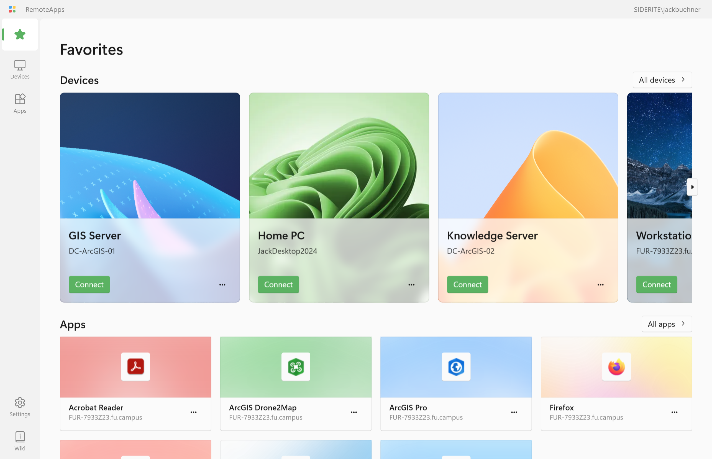
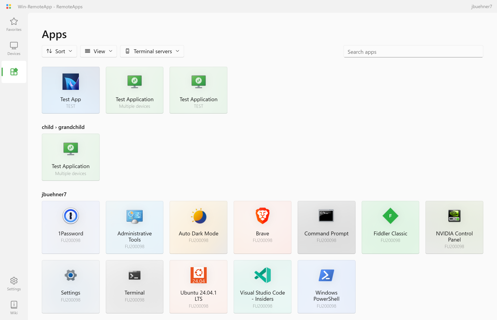
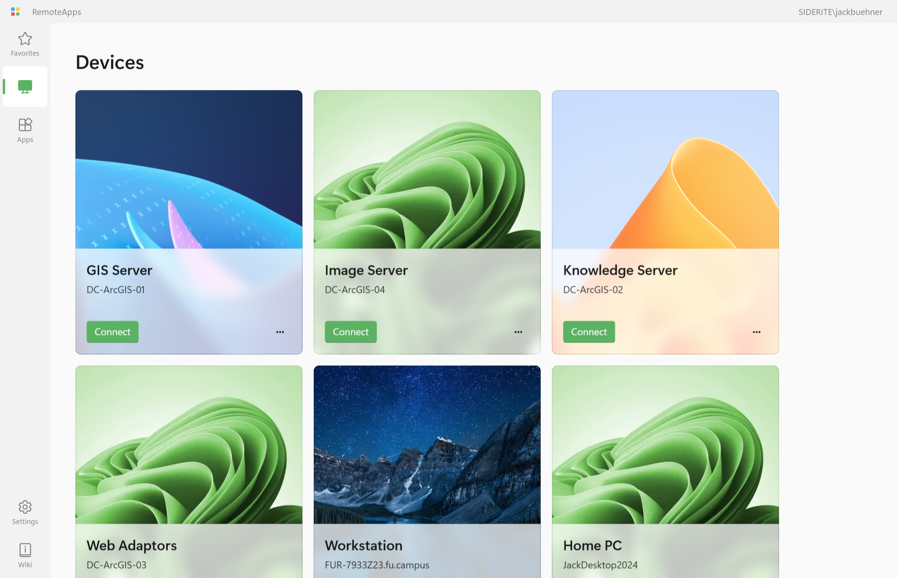
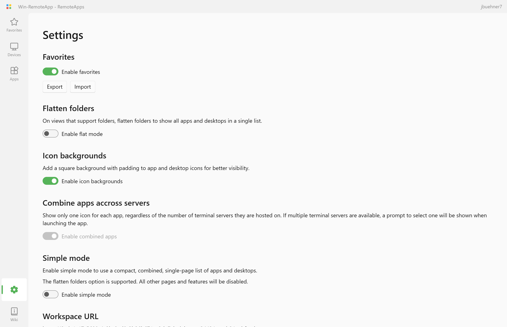
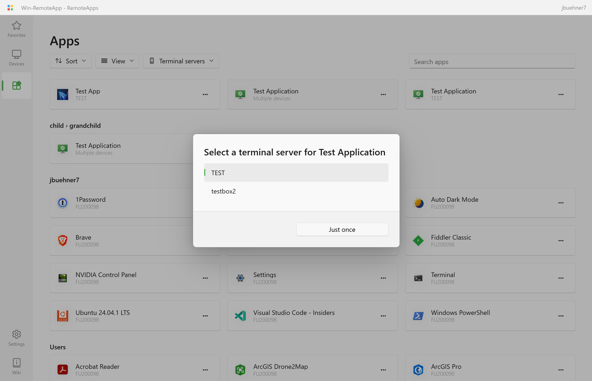
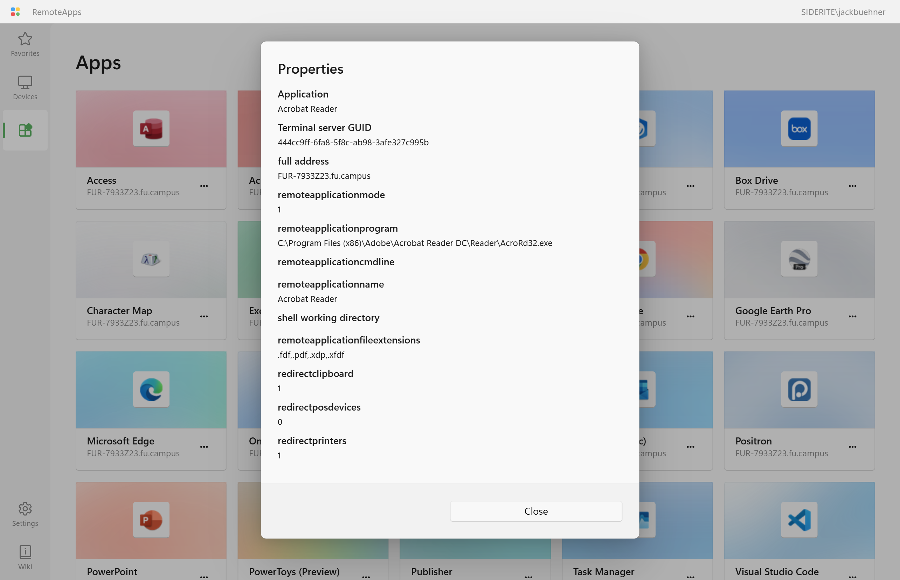

# RAWeb

<picture>
  <source media="(prefers-color-scheme: dark)" srcset="frontend/lib/assets/favorites_dark.png">
  <source media="(prefers-color-scheme: light)" srcset="frontend/lib/assets/favorites_light.png">
  
</picture>

A web interface and workspace provider for your RemoteApps and Desktops hosted on Windows 10, 11, and Server.

To set up RemoteApps on your PC, try [RemoteApp Tool](https://github.com/kimmknight/remoteapptool)[^1].

## Features

- A web interface for viewing your RemoteApp and Desktop RDP connections
  - Search the list of apps and devices
  - Favorite your most-used apps and devices for easy access
  - Sort apps and desktops by name, date modifed, and terminal server
  - Stale-while-revalidate caching for fast load times
  - Progressive web app with [window controls overlay](https://github.com/WICG/window-controls-overlay/blob/main/explainer.md) support
  - Download RDP files for your apps and devices, or directly launch them in Windows App or mstsc.exe[^2]
  - Follows the style and layout of WinUI 3
- Fully-compliant Workspace (webfeed) feature to place your RemoteApps and desktop connections in:
  - The Start Menu of Windows clients
  - The Android/iOS/iPadOS/MacOS Windows app
- File type associations on webfeed clients
- Different RemoteApps for different users and groups
- A setup script for easy installation

[^1]: If RemoteApp Tool is on the same device as RAWeb, enable TSWebAccess for each app that should appear in RAWeb. If on a different device, export RDP files and icons and follow [the instructions](https://github.com/kimmknight/raweb/wiki/Publishing-RemoteApps-and-Desktops) to add them to RAWeb.
[^2]:
    Directly launching apps and devices requires additional software.
    On **Windows**, install the [Remote Desktop Protocol Handler](https://apps.microsoft.com/detail/9N1192WSCHV9?hl=en-us&gl=US ocid=pdpshare) app from the Microsoft Store or install it with WinGet (`winget install "RDP Protocol Handler" --source msstore`)
    On **macOS&&, install [Windows App](https://apps.apple.com/us/app/windows-app/id1295203466) from the Mac App Store.
    On **iOS** or **iPadOS**, install [Windows App Mobile](https://apps.apple.com/us/app/windows-app-mobile/id714464092) from the App Store.
    Not supported on **Android\*\*.

## Installation

1. **Open PowerShell as an administrator**
   Press the Windows key + X, then select PowerShell (Administrator) or Terminal (Administrator).

2. **Copy and paste the code below, then press enter.**

```
irm https://github.com/kimmknight/raweb/releases/latest/download/install.ps1 | iex
```

3. Follow the prompts.

> [!IMPORTANT]
> The installer will retrieve the pre-built version of RAWeb from the latest release and install it to `C:\inetpub\RAWeb`.
> Refer to [the release page](https://github.com/kimmknight/raweb/releases/latest) for more details.

> [!NOTE]
> If Internet Information Services (IIS) or other required components are not already installed, the RAWeb installer will retreive and install them.

To install other versions, visit the [the releases page](https://github.com/kimmknight/raweb/releases) on GitHub.

<details>
<summary><h3>Other installation methods</h3></summary>

### Method 2. Non-interactive installation

To install the latest version without prompts, use the following command instead:

```
& ([scriptblock]::Create((irm https://github.com/kimmknight/raweb/releases/latest/download/install.ps1)) -AcceptAll
```

If RAWeb is already installed, installing with this option will replace the existing configuration and installed files. Resources, policies, and other data in `/App_Data` with be preserved.

### Method 3. Manual download and setup

1. Download the [latest RAWeb repository zip file](https://github.com/kimmknight/raweb/archive/master.zip).
2. Extract the zip file and run **Setup.ps1** in PowerShell as administrator.

### Method 4. Manual installation in IIS

_If you need to control user or group access to resources, want to configure RAWeb policies (application settings) via the web app, or plan to add RemoteApps and Desktops as a Workspace in the Windows App:_

1. Download and extract the latest pre-built RAWeb zip file from [the latest release](https://github.com/kimmknight/raweb/releases/latest).
2. Extract the contents of the zip file to a folder in your IIS website's directory (default is `C:\inetpub\wwwroot`)
3. In IIS Manager, create a new application pool with the name **raweb**. Use **.NET CLR Version v4.0.30319** with **Integrated** pipeline mode.
4. In IIS, convert the folder to an application. Use the **raweb** application pool.
5. At the application level, edit Anonymous Authentication to use the application pool identity (raweb) instead of IUSR.
6. On the `auth` subfolder only, disable Anonymous Authentication and enable Basic Authentication and Windows Authentication.
7. Disable permissions enheritance on the `RAWeb` directory.  a. In **IIS Manager**, right click the application and choose **Edit Permissions...**.
  b. Switch to the **Security** tab.
  c. Click **Advanced**.
  d. Click **Disable inheritance**.
7. Update the permissions to the following:

| Type | Principal | Access | Applies to |
|---|---|---|---|
|Allow|SYSTEM|Full Control|This folder, subfolders and files|
|Allow|Administrators|Full Control|This folder, subfolders and files|
|Allow|IIS AppPool\raweb|Read|This folder, subfolders and files|

8. Grant modify access to the `App_Data` folder for **IIS AppPool\raweb**:
  a. Under the application in IIS Manager, right click **App_Data** and choose **Edit Permissions...**.
  b. Switch to the **Security** tab.
  c. Click **Edit**.
  d. Select **raweb** and the check **Modify** in the **Allow column**. Click **OK**.
9. Grant read access to the `auth` folder for Everyone (Everyone is a built-in group that represents all users and groups).
10. Grant read access to `AppData\resources` for **Users**.
11. Grant read and execute access to `bin\SQLite.Interop.dll` for **IIS AppPool\raweb**

_If you only plan to use the web interface without authentication (some features will be disabled):_

1. Download and extract the latest pre-built RAWeb zip file from [the latest release](https://github.com/kimmknight/raweb/releases/latest).
2. Extract the contents of the zip file to a folder in your IIS website's directory (default is `C:\inetpub\wwwroot`)
3. In IIS Manager, create a new application pool with the name **raweb**. Use **.NET CLR Version v4.0.30319** with **Integrated** pipeline mode.
4. In IIS, convert the folder to an application. Use the **raweb** application pool.
At the application level and on the auth subfolder, edit Anonymous Authentication to use the application pool identity (raweb) instead of IUSR.
7. Ensure that the **Users** group has read and execute permissions for the application folder and its children.

</details>

## Using RAWeb

By default, RAWeb is available at https://127.0.0.1/RAWeb. To access RAWeb from other computers on your local network, replace 127.0.0.1 with your host PC or server's name. To access RAWeb from outside your local network, expose port 443 and replace 127.0.0.1 with your public IP address.

The following resources from the RAWeb wiki are also helpful when getting started:

- [Publishing RemoteApps and Desktops](https://github.com/kimmknight/raweb/wiki/Publishing-RemoteApps-and-Desktops)
- [Supported environments](https://github.com/kimmknight/raweb/wiki/Supported-environments)
- [File type associations for RAWeb webfeed clients](https://github.com/kimmknight/raweb/wiki/File-type-associations-for-RAWeb-webfeed-clients)
- [Trusting the RAWeb server SSL certificate](<https://github.com/kimmknight/raweb/wiki/Trusting-the-RAWeb-server-(Fix-security-error-5003)>)
- [Configure hosting server and terminal server aliases](https://github.com/kimmknight/raweb/wiki/Configure-hosting-server-and-terminal-server-aliases)

## Translations

Please follow the instructions at [TRANSLATING.md](TRANSLATING.md) to add or update translations.

## Screenshots

A web interface for your RemoteApps:

<picture>
  <source media="(prefers-color-scheme: dark)" srcset="frontend/lib/assets/apps_dark.png">
  <source media="(prefers-color-scheme: light)" srcset="frontend/lib/assets/apps_light.png">
  
</picture>

<picture>
  <source media="(prefers-color-scheme: dark)" srcset="frontend/lib/assets/devices_dark.png">
  <source media="(prefers-color-scheme: light)" srcset="frontend/lib/assets/devices_light.png">
  
</picture>

<picture>
  <source media="(prefers-color-scheme: dark)" srcset="frontend/lib/assets/settings_dark.png">
  <source media="(prefers-color-scheme: light)" srcset="frontend/lib/assets/settings_light.png">
  
</picture>

<picture>
  <source media="(prefers-color-scheme: dark)" srcset="frontend/lib/assets/terminal-server-picker_dark.png">
  <source media="(prefers-color-scheme: light)" srcset="frontend/lib/assets/terminal-server-picker_light.png">
  
</picture>

<picture>
  <source media="(prefers-color-scheme: dark)" srcset="frontend/lib/assets/app-properties_dark.png">
  <source media="(prefers-color-scheme: light)" srcset="frontend/lib/assets/app-properties_light.png">
  
</picture>

Webfeed puts RemoteApps in Windows client Start Menu:


Android RD Client app subscribed to the webfeed/workspace:


