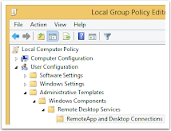

On Windows, you can deploy RAWeb workspaces to clients via Group Policy. This will automatically configure the workspace URL on the client without user interaction. See [Access RAWeb resources as a workspace](/docs/workspaces/) for more information.

<InfoBar severity="caution" title="Caution">
  The user account on the client must have a valid account on the RAWeb server in order to access the workspace.
</InfoBar>

Use the following steps to deploy RAWeb workspaces via Group Policy:

1. Open the Group Policy Management Console (`gpmc.msc`). Alternativly, you can use the Local Group Policy Editor (`gpedit.msc`) on the client machine.
2. Navigate to **User Configuration » Administrative Templates » Windows Components » Remote Desktop Services » RemoteApp and Desktop Connections**.\
  
3. Double click the policy setting **Specify default connection URL**.
4. Click **Enabled** and enter the [RAWeb workspace URL](/docs/workspaces/#workspace-url) in the **Default connection URL** text box.
5. Click **OK**.

