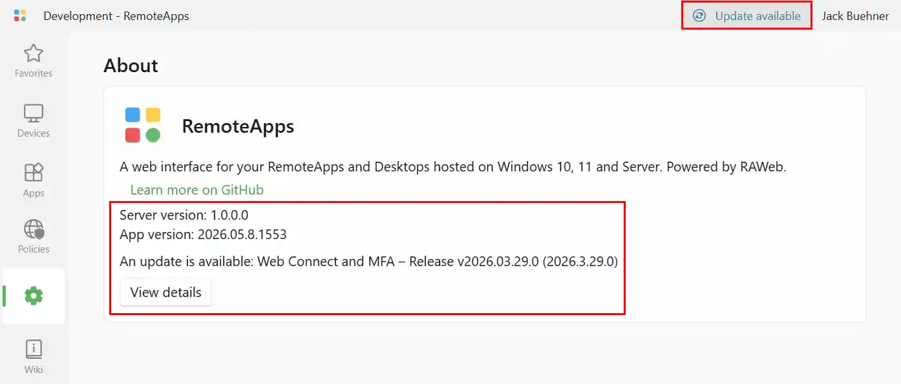

If you are signed in to RAWeb as an administrator, RAWeb will compare the current version of RAWeb with the latest full release available on RAWeb's GitHub releases page. RAWeb only checks for the latest available version; no information about your RAWeb installation is transmitted to GitHub.

If a newer version of RAWeb is available, RAWeb will display a notice in the top-right corner of the titlebar. Click the notice the view the release notes for the latest version, which usually includes installation instructions.

To see the current version of RAWeb Server and the RAWeb app, open the RAWeb app, go to the **Settings** page, and scroll down to the **About** section.

