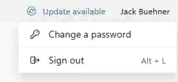

RAWeb allows users to change their passwords directly through the web interface. This feature can be enabled or disabled based on your organization's policies.

Allowing password changes via RAWeb is particularly useful in environments where a user may have an expired password and is unable to sign in to RAWeb or connect to remote resources until they update their password.

<PolicyDetails translationKeyPrefix="policies.PasswordChange.Enabled" />

## Accessing the password change feature

When the password change feature is enabled, users will see the password change option in the following locations:

### Profile menu

Any signed in user can access the password change feature from their profile menu in the top-right corner of the RAWeb interface.

### Sign in

If a user's password has expired or an administrator has chosen to force a password change, they will be prompted to change their password directly from the sign-in screen.

