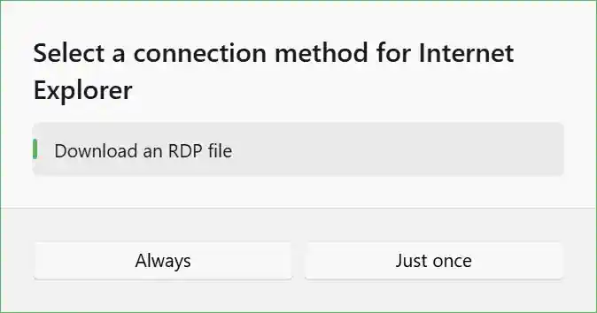

This policy controls whether the option to download an RDP file is available to users when connecting to resources.

When enabled, users will see a "Download RDP File" button in the connection dialog, allowing them to download an RDP file configured to connect to the selected resource. Users can then use this file with their preferred RDP client application.

When disabled, the "Download RDP File" option will not be shown, preventing users from downloading RDP files for resource connections.

If no connection methods are enabled, users will be unable to connect to resources via the web app. Instead, they will see this following dialog:

<PolicyDetails translationKeyPrefix="policies.App.ConnectionMethod.RdpFileDownload.Enabled" />
