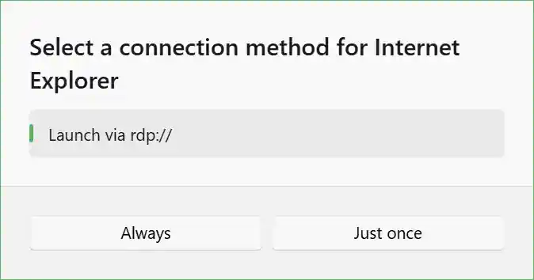
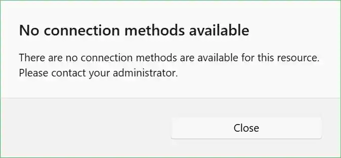

This policy controls whether the option to launch a resource via its rdp:// URI is available to users when connecting to resources.

When enabled, users will see a "Launch via rdp://" button in the connection dialog, allowing them to directly launch a resource without downloading it first. On supported systems, this will open the resource in the user's default RDP client application.

Refer to the [additional software table](/docs/connection-methods/#additional-software-for-rdp-protocol-uris) to learn which additional software is required for rdp:// URIs on each major platform.

When disabled, the "Launch via rdp://" option will not be shown.

If no connection methods are enabled, users will be unable to connect to resources via the web app. Instead, they will see the following dialog:

<PolicyDetails translationKeyPrefix="policies.App.ConnectionMethod.RdpProtocol.Enabled" />
