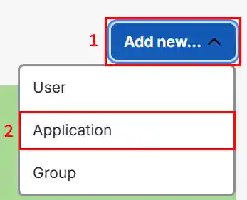

Enable this policy to require users to provide a second factor of authentication via Duo Security's Universal Prompt when signing in to RAWeb.

For alternative providers and MFA caveats, see [Enable multi-factor authentication (MFA) for the web app](/docs/security/mfa).

<PolicyDetails translationKeyPrefix="policies.App.Auth.MFA.Duo" />

Jump to a section:
- [Authentication flow](#auth-flow)
- [About Duo Security](#about-duo)
- [Create RAWeb application in Duo](#create-duo-app)
- [Configure RAWeb to use Duo](#configure-integration)
- [Exclude specific accounts from Duo MFA](#exclude-accounts)

## Authentication flow {#auth-flow}

When a user signs in to RAWeb with the Duo MFA policy enabled, the following flow occurs:

1. The user enters their username and password in RAWeb's sign-in form.
2. RAWeb verifies that the username and password are correct.
3. RAWeb updates its cache of the user's details (if the user cache is enabled).
4. RAWeb checks if a Duo MFA policy is configured for the user's domain. If no policy is found or the user's account is excluded, the user is signed in without further prompts.
5. RAWeb instructs the web client to load Duo's Universal Prompt.
5. The user selects their preferred second factor method in the Duo Universal Prompt and completes the authentication. If the user has not yet enrolled in Duo, they will be prompted to enroll up to two authentication factors.
6. Duo redirects to RAWeb.
7. If RAWeb receives a successful authentication response from Duo, the user is signed in to RAWeb. If the response indicates a failure or is missing, the sign-in attempt is rejected.

## About Duo Security {#about-duo}

[Duo](https://duo.com/) provides [multi-factor authentication services](https://duo.com/product/multi-factor-authentication-mfa) for a variety of applications and services. RAWeb integrates with Duo via the Duo Universal Prompt, which provides an interface for users to select their preferred second factor method during authentication.

Duo provides a free tier for up to 10 users. Larger teams can choose from several paid plans based on their needs. See [Duo's pricing page](https://duo.com/pricing) for more information. RAWeb's integration only requires the MFA feature, which is included in all plans.

## Create RAWeb application in Duo {#create-duo-app}

1. Sign in to [admin.duosecurity.com](https://admin.duosecurity.com/) with your Duo account's admin credentials.
    - If you do not have an account, you can start a free trial at [signup.duo.com](https://signup.duo.com/). The trial will automatically switch to the free tier after 30 days.
2. From the home page, click **Add new..** and choose **Application**.\
   
3. Find the **Partner WebSDK** application in the catalog and click **Add**.\
   
4. In the **Basic Configuration** section, change the **Application name** to RAWeb (or another name of your choice).
5. In the **Basic Configuration** section, set **User access** to **Enable for all users** (or another option of your choice).
6. IN the **Universal Prompt** section, set **Activate Universal Prompt** to **Show new Universal Prompt**. RAWeb has not been tested with the classic prompt.
6. In the **Settings** section, set **Voice greeting** to *Sign in to RAWeb* (or another greeting of your choice). This greeting will be played when users choose to authenticate via phone call.
7. Click **Save** to create the application.

## Configure RAWeb to use Duo {#configure-integration}

1. From the application's page in Duo's Admin panel, locate the **Client ID**, **Client secret**, and **API hostname** values in the **Details** section. You will need these values to configure RAWeb.
2. In RAWeb's web interface, navigate to the **Policies** page.
3. Open the **Configure Duo Universal Prompt multi-factor authentication (MFA)** policy dialog.
4. Set the policy state to **Enabled**.
5. In the **Options » Applications** section, click **Add new**.
6. Enter the following values:
    - **Client ID**: Enter the client ID obtained from Duo.
    - **Client secret**: Enter the client secret obtained from Duo.
    - **API hostname**: Enter the API hostname obtained from Duo.
    - **Domains**: Enter a comma-separated list of domains (e.g., `INTERNAL,TESTBOX,example.org`) for which this Duo configuration should be used. Use `*` to apply the connection to all domains. The domains specified here should match
    the domain part of the username used to sign in (e.g., for the username `INTERNAL\alice`, the domain is `INTERNAL`).
    If a domain has a known FQDN (e.g., `example.org`), use it instead of the NetBIOS format domain (e.g. `EXAMPLE`).
7. Click OK to save the policy.
8. Sign out of RAWeb and sign back in to test the configuration. After entering your credentials, you should be prompted to complete the second factor authentication via Duo's Universal Prompt.

If you need different Duo configurations for different domains, repeat steps 5-7 to add additional connections with the appropriate domains assigned to each Duo client ID, client secret, and API hostname.

<InfoBar>

Wildcard domains (`*`) will match any domain not explicitly listed in other connections.

</InfoBar>

## Exclude specific accounts from Duo MFA {#exclude-accounts}

To exclude specific user accounts from being prompted for Duo MFA, you can add their usernames to the **Excluded account usernames** field in the Duo MFA policy dialog. Usernames should be specified in the format `DOMAIN\username` or `domain.tld\username`. For local accounts, use `.\username` or `MACHINE_NAME\username`, where `MACHINE_NAME` is the name of the computer.

<InfoBar severity="caution" title="Caution">
   The username is case-sensitive and must match exactly the username used during sign-in. The domain part is case-insensitive.
   

   RAWeb will automatically translate the username to the correct case based on the user's actual account information when they sign in. However, when adding usernames to the exclusion list, ensure that the case matches exactly.
</InfoBar>

1. In RAWeb's web interface, navigate to the **Policies** page.
1. Open the **Configure Duo Universal Prompt multi-factor authentication (MFA)** policy dialog.
1. In the **Options » Excluded accounts** section, click **Add new**.
1. Enter the username of a account to exclude in the format described above. To exclude multiple accounts, add each username as a separate entry.
1. Click OK to save the policy.
1. Sign out of RAWeb and sign back in with an excluded account to verify that the Duo MFA prompt is not shown.
