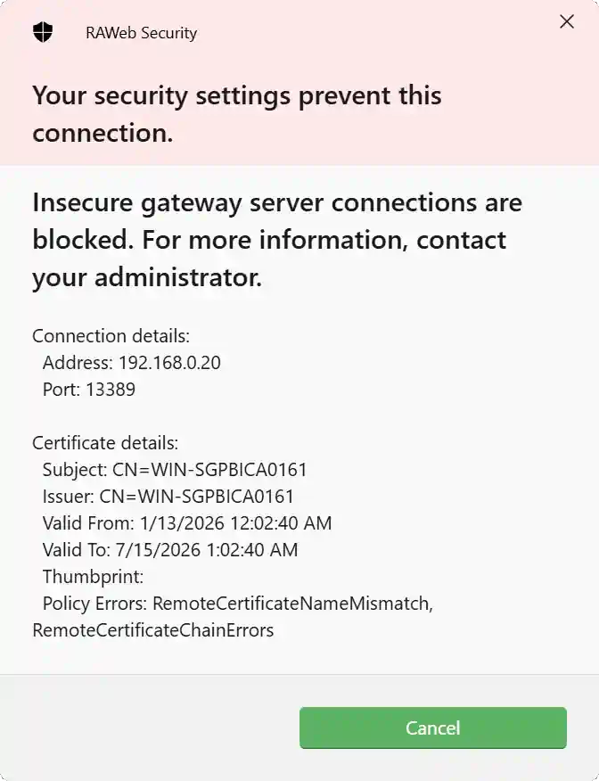
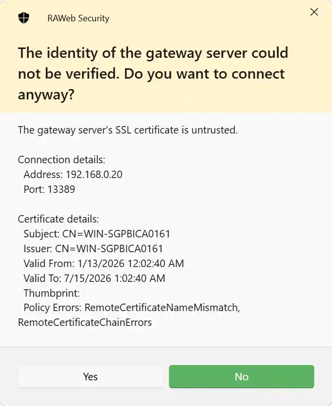

By default, RAWeb will not allow connections to a gateway server if the server's SSL certificate is untrusted. This policy controls whether users can ignore gateway certificate errors when connecting via the web client.

When users cannot ignore gateway certificate errors, they will see a message similar to the following when attempting to connect to a gateway server with an untrusted SSL certificate:

When users can ignore gateway certificate errors, they will see a message similar to the following when attempting to connect to a gateway server with an untrusted SSL certificate:

<PolicyDetails translationKeyPrefix="policies.GuacdWebClient.Security.AllowIgnoreGatewayCertErrors" open />
