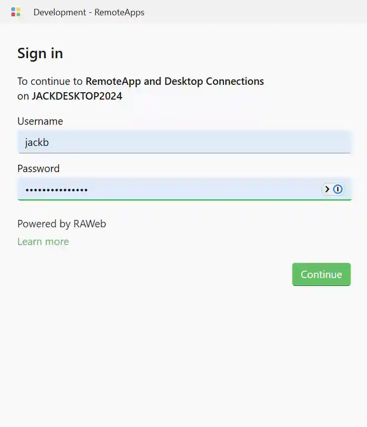

Enable this policy to require users to provide a second factor of authentication via LoginTC when signing in to RAWeb.

For alternative providers and MFA caveats, see [Enable multi-factor authentication (MFA) for the web app](/docs/security/mfa).

<PolicyDetails translationKeyPrefix="policies.App.Auth.MFA.LoginTC" />

Jump to a section:
- [Authentication flow](#auth-flow)
- [About LoginTC](#about-logintc)
- [Create RAWeb application in LoginTC](#create-logintc-app)
- [Configure RAWeb to use LoginTC](#configure-integration)
- [Exclude specific accounts from LoginTC MFA](#exclude-accounts)

## Authentication flow {#auth-flow}

When a user signs in to RAWeb with the LoginTC MFA policy enabled, the following flow occurs:

1. The user enters their username and password in RAWeb's sign-in form.
2. RAWeb verifies that the username and password are correct.
3. RAWeb updates its cache of the user's details (if the user cache is enabled).
4. RAWeb checks if a LoginTC MFA policy is configured for the user's domain. If no policy is found or the user's account is excluded, the user is signed in without further prompts.
5. RAWeb instructs the web client to load the LoginTC authentication prompt.
6. The user completes the LoginTC authentication challenge.
7. LoginTC redirects to RAWeb.
8. If RAWeb receives a successful authentication response from LoginTC, the user is signed in to RAWeb. If the response indicates a failure or is missing, the sign-in attempt is rejected.

<InfoBar>

The LoginTC integration requires that a user with the same username exists in both the RAWeb host machine and LoginTC. If the user does not exist in LoginTC, the LoginTC authentication will fail and the sign-in attempt will be rejected.

</InfoBar>

## About LoginTC {#about-logintc}

[LoginTC](https://www.logintc.com/) provides multi-factor authentication for a variety of applications and services. RAWeb integrates with LoginTC to provide a second factor of authentication for users signing in to the web app.

## Create RAWeb application in LoginTC {#create-logintc-app}

1. Sign in to your LoginTC Admin Panel. \
   &nbsp;&nbsp;&nbsp;&nbsp;For LoginTC Cloud: [https://cloud.logintc.com](https://cloud.logintc.com/)
2. In the left navigation menu, click **Applications**.
3. At the top right of the Applications page, click **Create Application**.
4. Find **RAWeb** in the list of applications and click it to create a new application for RAWeb. You will be redirected to the new application's page.
5. Note the **Application ID** and  **Application API Key**. You will need these to configure RAWeb.

## Configure RAWeb to use LoginTC {#configure-integration}

1. In RAWeb's web interface, navigate to the **Policies** page.
2. Open the **Configure LoginTC multi-factor authentication (MFA)** policy dialog.
3. Set the policy state to **Enabled**.
4. In the **Options » Applications** section, click **Add new**.
5. Enter the following values:
    - **Application ID**: Enter the application ID obtained from LoginTC.
    - **API key**: Enter the API key obtained from LoginTC.
    - **Host**: Enter the hostname of your LoginTC instance. For LoginTC Cloud, use `cloud.logintc.com`.
    - **Domains**: Enter a comma-separated list of domains (e.g., `INTERNAL,TESTBOX,example.org`) for which this LoginTC configuration should be used. Use `*` to apply the connection to all domains. The domains specified here should match the domain part of the username used to sign in (e.g., for the username `INTERNAL\alice`, the domain is `INTERNAL`).
6. Click OK to save the policy.
7. Sign out of RAWeb and sign back in to test the configuration. After entering your credentials, you should be prompted to complete the second factor authentication via LoginTC.

If you need different LoginTC configurations for different domains, repeat steps 4-6 to add additional connections with the appropriate domains assigned to each application ID, API key, and hostname.

<InfoBar>

Wildcard domains (`*`) will match any domain not explicitly listed in other connections.

</InfoBar>

## Exclude specific accounts from LoginTC MFA {#exclude-accounts}

To exclude specific user accounts from being prompted for LoginTC MFA, you can add their usernames to the **Excluded account usernames** field in the LoginTC MFA policy dialog. Usernames should be specified in the format `DOMAIN\username` or `domain.tld\username`. For local accounts, use `.\username` or `MACHINE_NAME\username`, where `MACHINE_NAME` is the name of the computer.

<InfoBar severity="caution" title="Caution">
   The username is case-sensitive and must match exactly the username used during sign-in. The domain part is case-insensitive.
   

   RAWeb will automatically translate the username to the correct case based on the user's actual account information when they sign in. However, when adding usernames to the exclusion list, ensure that the case matches exactly.
</InfoBar>

1. In RAWeb's web interface, navigate to the **Policies** page.
1. Open the **Configure LoginTC multi-factor authentication (MFA)** policy dialog.
1. In the **Options » Excluded accounts** section, click **Add new**.
1. Enter the username of an account to exclude in the format described above. To exclude multiple accounts, add each username as a separate entry.
1. Click OK to save the policy.
1. Sign out of RAWeb and sign back in with an excluded account to verify that the LoginTC MFA prompt is not shown.
