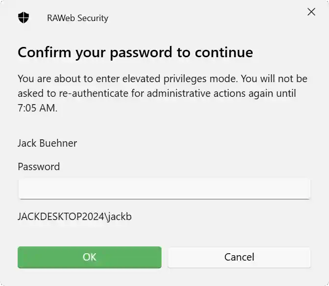

Administrators normally sign in to RAWeb with read-only administrative access. To perform a privileged action, such as adding a RemoteApp or changing a policy, they must confirm their password again to obtain a short-lived, elevated authorization token. In general, any action that results in changes to data controlled by RAWeb requires elevated permissions.

When an administrator attempts a privileged action without an elevated authorization token, the request is rejected and a dialog appears with a prompt to confirm the administrator's password. Once confirmed, RAWeb issues a separate, short-lived auth ticket (valid for one hour) with read and write administrative access, and the original request is retried automatically.

<PolicyDetails translationKeyPrefix="policies.App.Auth.Sudo.Enabled" />

## Behavior when the policy is disabled

<InfoBar title="Important security warning" severity="caution">
  Disabling this policy is not recommended. RAWeb's tokens are long-lived, and allowing administrators to receive write access in their main login token increases the risk of damages if an administrator's token is compromised.
</InfoBar>

When this policy is disabled, administrators are granted read-and-write administrative access immediately upon signing in, and are not prompted to elevate via sudo when performing a privileged action. This is less secure, as it allows an attacker who compromises an administrator's account to make changes without needing to know the administrator's password.

## Existing sessions are not affected

This policy only affects new logins; it does not change the privilege level of auth cookies that have already been issued. Administrators who are already signed in keep their current access level until they sign in again.

## Workspace authentication

All workspace authentication via the `/api/auth/workspace` endpoint is performed at the lowest privilege level (ReadOnlyUser). This means that workspace clients cannot view or modify any administrative data. This behavior cannot be controlled via policy.

# Older versions of RAWeb

RAWeb versions from before August 2026 did not have the tiered token privileges feature, and administrators always signed in with read-and-write administrative access. We recommend upgrading to a newer version of RAWeb and enabling this policy to improve security.
