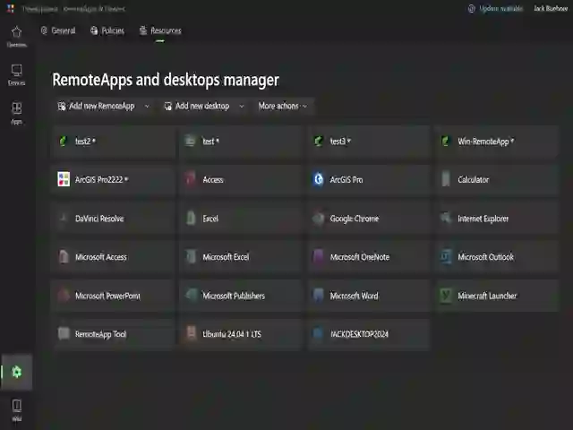

## Export

RAWeb allows you to export all managed resources (uploaded RDP files, manually created RemoteApps and desktops, and registry-based resources) individually or as a bundle.

### Export a single managed resource

1. Go to the **Settings** page and click the **Resources** tab.
2. Right click on the resource you want to export and choose **Export as resource file**.
3. Your browser will download a `.tsresource` file. This file is a special zip archive that contains an RDP file, a metadata file, and associated icons or wallpaper for the resource.

### Export all managed resources

1. Go to the **Settings** page and click the **Resources** tab.
2. Click the the **More actions** button. Chose **Export resources archive**.
3. Once the archive is ready, your browser will download a `.tsresourcebundle` file. This file is
   a zip archive that contains `.tsresource` files for each resource.

## Import

RAWeb also allows you to import any `.rdp` file or previously exported `.resource`, `.tsresource`, or `.tsresourcebundle` file.

### Import by dragging and dropping one or more files

1. Drag and drop one or more `.rdp`, `.resource`, `.tsresource`, or `.tsresourcebundle` files onto the RAWeb web interface.
2. RAWeb will show an **Import resources** dialog. For each resource, review the details and make any necessary changes. To skip a resource, choose **Skip**. To accept a resource, choose **OK**. To cancel importing any remaining resources, choose **Cancel**. \
   

### Import from the more actions menu

1. Go to the **Settings** page and click the **Resources** tab.
2. Click the the **More actions** button. Chose **Add resources from files**
3. Select one or more `.rdp`, `.resource`, `.tsresource`, or `.tsresourcebundle` files from your computer. Click **Open**.
4. RAWeb will show an **Import resources** dialog. For each resource, review the details and make any necessary changes. To skip a resource, choose **Skip**. To accept a resource, choose **OK**. To cancel importing any remaining resources, choose **Cancel**.
