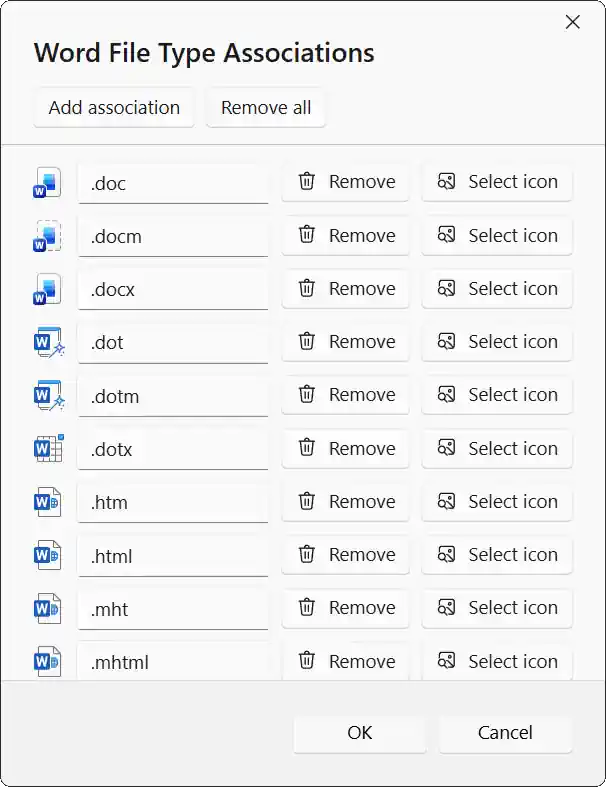

RAWeb can associate file types on clients to RemoteApps. For example, you can configure RAWeb to open a Microsoft Word RemoteApp when the client opens a `.docx` file.

## Requirements

The following requirements must be met for file type associations to work:

- The client must be connected to RAWeb's webfeed.
- The client webfeed URL must be configured via Group Policy (or Local Policy).
- RDP files need to have file types listed within.
- Each RemoteApp on must be configured to allow command line parameters. This is the true for all RemoteApps created via RAWeb.

File type associations **will not work** if you configure the webfeed URL via the RemoteApp and Desktop Connections control panel. You **must** configure it via policy. If you cannot configure the policy, you may be able to use [Kelbin Tegelaar's workaround](https://www.cyberdrain.com/adding-remote-app-file-associations-via-powershell/).

## Add file type associations to managed resources {#managed-resource-file-type-associations}

1. Navigate to **Policies**.
2. At the top of the **Policies** page, click **Manage resources** to open the RemoteApps and desktops manager dialog.
3. Click the RemoteApp for which you want to configure file type associations.
4. In the **Advanced** group, click the **Configure file type associations** button.\
   
5. You will see a dialog where you can add, remove, and edit file type associations.\
   Additionally, for RemoteApps that belong to the terminal server that hosts RAWeb, you can select specific icons for each file type association. \
   Click **Add association** to add a new file type association. All file type associations must start with a dot and must not include an asterisk.\
   
6. Click **OK** to confirm the specified file type associations.
7. Click **OK** to save the RemoteApp details.

## Manually add file type associations to RDP files

1. Open the RDP file in a text editor.
2. Add a new line:
    ```
    remoteapplicationfileextensions:s:[file extensions separated by commas]
    ```

    ![][1]

[1]: ./add-file-types-to-rdp-files.png

### Add icons for each file type

To add icons for file type associations, specify an `.ico` or `.png` file with the same name as the `.rdp` file followed by a dot (.) and then the file extension.

For example, to set an icon for all `.docx` files which will open via `Word.rdp`, you would need an icon file named: `Word.docx.ico`.

<InfoBar>
  RAWeb will not include an icon in the workspace/webfeed unless the width and height are the same.
</InfoBar>

<script setup>
   import { InfoBar } from '$components';
</script>
