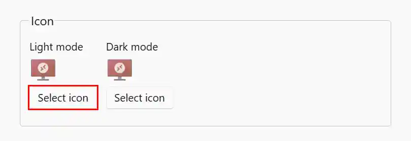
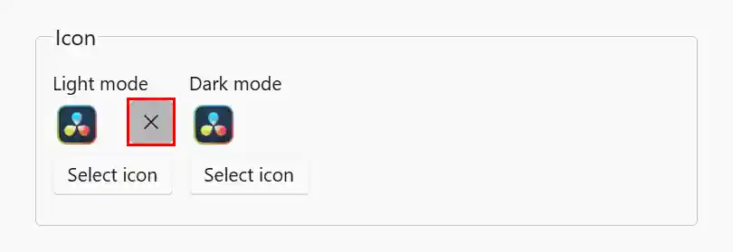
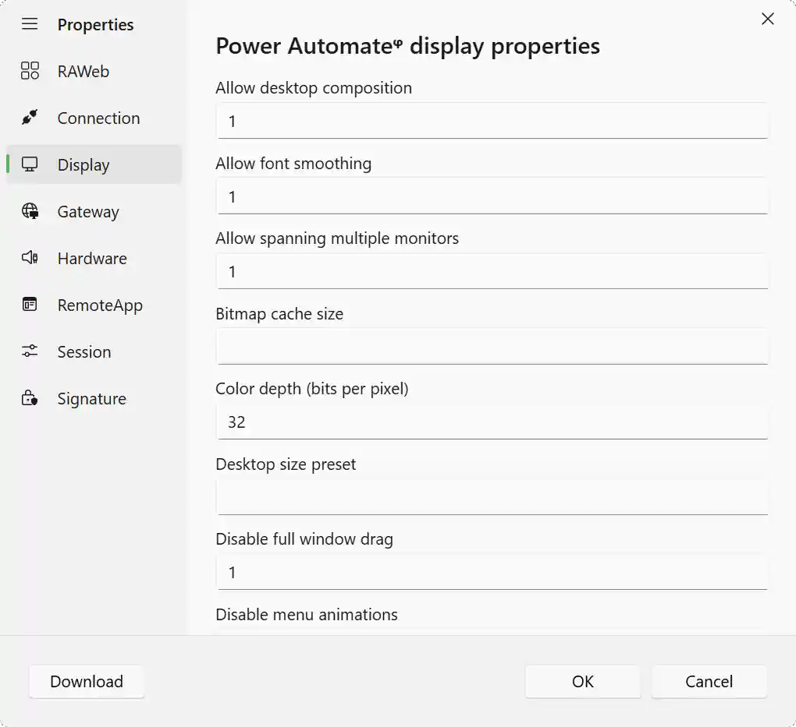

By default, RAWeb will install to **C:\\inetpub\RAWeb**. Parts of this guide assume that RAWeb is installed to the default location.

RAWeb can publish RDP files from any device. RAWeb can also publish RemoteApps specified in the registry.

Jump to a section:
- [Managed/uploaded RDP files](#managed-file-resources)
- [Registry RemoteApps and desktop](#managed-registry-resources)
- [Registry RemoteApps via RemoteApp Tool (deprecated)](#remoteapp-tool)
- [Host system desktop](#host-system-desktop)
- [Standard RDP files](#standard-rdp-files)

## Managed/uploaded RDP files (managed file resources) {#managed-file-resources}

RAWeb can publish any uploaded RDP file. The RDP file can point to any terminal server. These RemoteApps and desktops are called managed file resources and are stored in `C:\\inetpub\RAWeb\App_Data\managed_resources`.

<InfoBar severity="attention" title="Secure context required">
   The resources manager requires a secure context (HTTPS). Make sure you access RAWeb's web interface via HTTPS in order to upload, edit, or delete managed file resources.
    
    
   If you cannot access RAWeb via HTTPS, you may access RAWeb from <code>localhost</code> (http://localhost/RAWeb) via any browser based on Chromium or Firefox on the host server – they treat localhost as a secure context.
</InfoBar>

To upload an RDP file, sign in to RAWeb's web interface with an administrator account and follow these steps:
1. Navigate to **Policies**.
2. At the top of the **Policies** page, click **Manage resources** to open the RemoteApps and desktops manager dialog. \
You will see a list of resources currently managed by RAWeb. In addition to uploaded RDP files, this interface shows resources specified in the registry of the RAWeb host server. Uploaded managed file resources are denoted by a superscript lowercase greek letter *phi* (φ). \
   
3. Click the dropdown arrow next to the **Add new RemoteApp** button at the top left of the dialog. Select **Add from RDP file** to open the RDP file upload dialog.
4. Select an RDP file from your computer. The RDP file must contain at least the following properties:
   - `full address:s:`
5. Once RAWeb finishes processing the selected RDP file, you will see an **Add new RemoteApp** or **Add new Desktop** dialog that is populated with details from the RDP file.\
   
6. Configure the properties as desired. Make sure that **Show in web interface and workspace feeds** is set to **Yes**. Click **OK** to finish adding the resource.

### Change a RemoteApp's icon

To change the icon for a managed file RemoteApp, you can upload any icon file that is supported by your browser. It will convert the icon to PNG format and store it in RAWeb's managed resources folder. You will see a preview of the uploaded icon in the RemoteApp properties dialog before saving the changes.

Light mode and dark mode icons can be specified separately. If only a light mode icon is specified, RAWeb will also use it for dark mode. Most workspace clients only support light mode icons.

<InfoBar severity="attention" title="Icon requirements">
   RemoteApp icons must have the same width and height. RAWeb may choose to ignore icons that do not meet this requirement.
</InfoBar>

1. Navigate to **Policies**.
2. At the top of the **Policies** page, click **Manage resources** to open the RemoteApps and desktops manager dialog.
3. Click the RemoteApp for which you want to change the icon.
4. In the **Icon** group, click the **Select icon** button for either light mode or dark mode. The browser will show a prompt to upload an icon.\
   
5. Review the new icon preview. To remove the icon, click the **X** button next to the preview.\
   
6. Click **OK** to save the RemoteApp details, including the new icon(s).

### Change a Desktop's wallpaper

To change the wallpaper for a desktop, you can upload any wallpaper file that is supported by your browser. It will convert the wallpaper to PNG format and store it in RAWeb's managed resources folder. You will see a preview of the uploaded wallpaper in the desktop's properties dialog before saving the changes.

Light mode and dark mode wallpaper can be specified separately. If only light mode wallpaper is specified, RAWeb will also use it for dark mode. Most workspace clients only support light mode.

1. Navigate to **Policies**.
2. At the top of the **Policies** page, click **Manage resources** to open the RemoteApps and desktops manager dialog.
3. Click the desktop for which you want to change the wallpaper.
4. In the **Wallpaper** group, click the **Select wallpaper** button for either light mode or dark mode. The browser will show a prompt to upload an image.\
   
5. Review the new wallpaper preview. To remove the wallpaper, click the **X** button next to the preview.\
   
6. Click **OK** to save the desktop details, including the new wallpaper.

### Configure file type associations

See [Add file type associations to managed resources](/docs/publish-resources/file-type-associations/#managed-resource-file-type-associations) for instructions on how to configure file type associations for managed RemoteApps.

### Configure user and group access

See [Configuring user-based and group‐based access to resources](/docs/publish-resources/resource-folder-permissions/#managed-resources) for instructions on how to configure user and group access for managed RemoteApps.

### Customize individual RDP file properties

RAWeb allows you to customize most RDP file properties for managed resources. This allows you to optimize the experience for individual RemoteApps and desktops.

1. Navigate to **Policies**.
2. At the top of the **Policies** page, click **Manage resources** to open the RemoteApps and desktops manager dialog.
3. Click the resource for which you want to configure RDP file properties.
4. In the **Advanced** group, click the **Edit RDP file** button.
5. You will see a dialog where you can edit supported RDP file properties. Properties related to settings that are available in the main RemoteApp properties dialog are disabled in this dialog. If you want to test the properties before you save them, click the **Download** button to download a test RDP file.\
   
   <InfoBar severity="information" title="Tip">
      Place your mouse cursor over each property label to view a description and possible values.
   </InfoBar>
6. After making your changes, click **OK** to confirm the specified RDP file properties.
6. Click **OK** to save the RemoteApp or desktop details.

### Remove a managed file resource

1. Navigate to **Policies**.
2. At the top of the **Policies** page, click **Manage resources** to open the RemoteApps and desktops manager dialog.
3. Select the RemoteApp or desktop you want to delete.
4. In the **Danger zone** group, click the **Remove RemoteApp** or **Remove desktop** button.\
   

## Registry RemoteApps (managed registry resources) {#managed-registry-resources}

RAWeb can publish RDP files from `HKEY_LOCAL_MACHINE\SOFTWARE\Microsoft\Windows NT\CurrentVersion\Terminal Server\CentralPublishedResources`. Only applications with the `ShowInPortal` DWORD set to `1` will be published.

<InfoBar severity="attention" title="Secure context required">
   The resources manager requires a secure context (HTTPS). Make sure you access RAWeb's web interface via HTTPS in order to upload, edit, or delete registry resources.
    
    
   If you cannot access RAWeb via HTTPS, you may access RAWeb from <code>localhost</code> (http://localhost/RAWeb) via any browser based on Chromium or Firefox on the host server – they treat localhost as a secure context.
</InfoBar>

To add a new RemoteApp, sign in the RAWeb's web interface with an administrator account and follow these steps:
1. Navigate to **Policies**.
2. At the top of the **Policies** page, click **Manage resources** to open the RemoteApps and desktops manager dialog. \
You will see a list of RemoteApps currently listed in `HKEY_LOCAL_MACHINE\SOFTWARE\Microsoft\Windows NT\CurrentVersion\Terminal Server\TSAppAllowList\Applications`. By default, if an app is not listed here, it will not be possible to remotely connect to it.\
   
4. To add a new RemoteApp, click the **Add new RemoteApp** button at the top left of the dialog to open the app discovery dialog.\
You will see a list of apps that RAWeb was able to discover on the server. RAWeb lists all packaged apps and any shortcut included in the system-wide Start Menu folder.\
   
5. Click the app you want to add. You will see a pre-populated **Add new RemoteApp** dialog.\
   
6. Configure the properties as desired. Make sure that **Show in web interface and workspace feeds** is set to **Yes**. Click **OK** to save the RemoteApp details to the registry.

### Change the RemoteApp icon

To change the icon for a registry RemoteApp, you need to know the path to an icon file on the terminal server. You can use any `.exe`, `.dll`, `.ico`, `.png`, `.jpg`, `.jpeg`, `.bmp`, or `.gif` source on the server.

1. Navigate to **Policies**.
2. At the top of the **Policies** page, click **Manage resources** to open the RemoteApps and desktops manager dialog.
3. Click the RemoteApp for which you want to change the icon.
4. In the **Icon** group, click the **Select icon** button.\
   
5. In the **Select icon** dialog, enter the full path to the icon file on the server. Press Enter/Return on your keyboard to load icons at that path. If you specify an `exe`, `dll`, or `ico` file with multiple contained icons, you will see multiple icons. Click the icon you want to use.\
   
6. Click **OK** to save the RemoteApp details.

### Configure file type associations

See [Add file type associations to managed resources](/docs/publish-resources/file-type-associations/#managed-resource-file-type-associations) for instructions on how to configure file type associations for registry RemoteApps.

### Configure user and group access

See [Configuring user-based and group‐based access to resources](/docs/publish-resources/resource-folder-permissions/#managed-resources) for instructions on how to configure user and group access for registry RemoteApps.

### Customize individual RDP file properties

RAWeb allows you to customize most RDP file properties for managed resources. This allows you to optimize the experience for individual RemoteApps and desktops.

<InfoBar severity="caution">
    Properties will be ignored and possibly overwritten for any properties specified in the policy: <b>Add additional RDP file properties to RemoteApps listed in the registry</b>.
</InfoBar>

1. Navigate to **Policies**.
2. At the top of the **Policies** page, click **Manage resources** to open the RemoteApps and desktops manager dialog.
3. Click the RemoteApp for which you want to configure RDP file properties.
4. In the **Advanced** group, click the **Edit RDP file** button.
   <InfoBar severity="attention">
      If you do not see the <b>Edit RDP file</b> button, make sure the <b>Use a dedicated collection for RemoteApps in the registry instead of the global list </b> policy is set to <b>Disabled</b> or <b>Not configured</b>.
   </InfoBar>
5. You will see a dialog where you can edit supported RDP file properties. Properties related to settings that are available in the main RemoteApp properties dialog are disabled in this dialog. If you want to test the properties before you save them, click the **Download** button to download a test RDP file.\
   
   <InfoBar severity="information" title="Tip">
      Place your mouse cursor over each property label to view a description and possible values.
   </InfoBar>
6. After making your changes, click **OK** to confirm the specified RDP file properties.
6. Click **OK** to save the RemoteApp details.

### Remove a RemoteApp from the registry

1. Navigate to **Policies**.
2. At the top of the **Policies** page, click **Manage resources** to open the RemoteApps and desktops manager dialog.
3. Select the RemoteApp you want to delete.
4. In the **Danger zone** group, click the **Remove RemoteApp** button.\
   

## Registry RemoteApps via RemoteApp Tool (deprecated) {#remoteapp-tool}

RAWeb can publish RDP files from `HKEY_LOCAL_MACHINE\SOFTWARE\Microsoft\Windows NT\CurrentVersion\Terminal Server\TSAppAllowList\Applications`. Only applications with the `ShowInTSWA` DWORD set to `1` will be published. This behavior is not the preferred method of adding registry RemoteApps, and support may be removed in a future release. Use the RemoteApps and desktops manager in RAWeb's web interface instead.

<InfoBar severity="attention" title="Policy configuration required">
   You must set the <b>Use a dedicated collection for RemoteApps in the registry instead of the global list </b> policy to <b>Disabled</b> in order for RAWeb to publish RemoteApps from the registry path <code>HKEY_LOCAL_MACHINE\SOFTWARE\Microsoft\Windows NT\CurrentVersion\Terminal Server\TSAppAllowList\Applications</code>.
</InfoBar>

Use [RemoteApp Tool](https://github.com/kimmknight/remoteapptool) to add, remove, and configure RemoteApps in the registry.

1. Open **RemoteApp Tool**.
2. Click the green plus icon in the bottom-left corner to **Add a new RemoteApp**. Find the executable for the application you want to add.\
   
3. The application you added should now appear in the list of applications. **Double click** it in the list to configure the properties.
4. Set **TSWebAccess** to **Yes**. You may configure other options as well. Remember to click **Save** when you are finished.
   <InfoBar>
      Make sure <b>Command line option</b> is set to <b>Optional</b> or <b>Enforced</b> to allow <a href="/docs/publish-resources/file-type-associations">file type associations</a> to work.
   </InfoBar>
   

The application should now appear in RAWeb.

## Host system desktop {#host-system-desktop}

RAWeb can also publish the host system's desktop as a managed resource. This allows users to connect to the RAWeb host server's desktop via RAWeb.

As an added benefit, because the desktop is on the host server, RAWeb can detect and use the host server's wallpaper as the desktop wallpaper in RAWeb's web interface and workspace clients. For users who have set a different wallpaper, chosen a solid background, or enabled Windows spotlight, RAWeb will use the chosen desktop background for that user.

Publishing the host system desktop also makes it easy to access any application that is not directly exposed as a RemoteApp.

<InfoBar severity="attention" title="Secure context required">
   The resources manager requires a secure context (HTTPS). Make sure you access RAWeb's web interface via HTTPS in order to upload, edit, or delete managed file resources.
    
    
   If you cannot access RAWeb via HTTPS, you may access RAWeb from <code>localhost</code> (http://localhost/RAWeb) via any browser based on Chromium or Firefox on the host server – they treat localhost as a secure context.
</InfoBar>

<InfoBar severity="attention" title="Policy configuration required">
   If you do not see the host system desktop in the resources manager, make sure the <b>Use a dedicated collection for RemoteApps in the registry instead of the global list </b> policy is set to <b>Disabled</b> or <b>Not configured</b>.
</InfoBar>

To publishing the host system desktop, follow these steps:
1. Navigate to **Policies**.
2. At the top of the **Policies** page, click **Manage resources** to open the RemoteApps and desktops manager dialog. \
You will see a list of resources currently managed by RAWeb. \
   
3. Look for a desktop with the same name as the host system. In the above example, the host system is named *DC-CORE-1* and runs Windows Server 2025, so the desktop is named *DC-CORE-1* and shows the default Windows Server 2025 wallpaper. Click the desktop to open the desktop properties dialog. \
   
4. Configure the properties as desired. Make sure that **Show in web interface and workspace feeds** is set to **Yes**. Click **OK** to finish adding the resource.

### Configure user and group access

See [Configuring user-based and group‐based access to resources](/docs/publish-resources/resource-folder-permissions/#managed-resources) for instructions on how to configure user and group access for the system desktop. Review the section on managed resources.

### Customize individual RDP file properties

RAWeb allows you to customize most RDP file properties for the system desktop. This allows you to optimize the experience for clients connecting the the desktop.

1. Navigate to **Policies**.
2. At the top of the **Policies** page, click **Manage resources** to open the RemoteApps and desktops manager dialog.
3. Click the system desktop.
4. In the **Advanced** group, click the **Edit RDP file** button.
5. You will see a dialog where you can edit supported RDP file properties. Properties related to settings that are available in the main system desktop properties dialog are disabled in this dialog. If you want to test the properties before you save them, click the **Download** button to download a test RDP file.\
   
   <InfoBar severity="information" title="Tip">
      Place your mouse cursor over each property label to view a description and possible values.
   </InfoBar>
6. After making your changes, click **OK** to confirm the specified RDP file properties.
6. Click **OK** to save the system desktop details.

## Standard RDP files {#standard-rdp-files}

RDP files should be placed in **C:\\inetpub\RAWeb\App_Data\resources**. Any RDP file in this folder will be automatically published.

You can create subfolders to sort your RemoteApps and desktops into groups. RemoteApps and desktops are organized into sections on the RAWeb web interface based on subfolder name.

To add icons, specify a **.ico** or **.png** file in with the same name as the **.rdp** file.

- .ico and .png icons are the only file types supported.
- For RemoteApps, RAWeb will not serve an icon unless the width and height are the same.
- For desktops, if the icon width and height are not the same, RAWeb will assume that the icon file represents the destkop wallpaper. When an icon is needed for the desktop, RAWeb will place the wallpaper into the blue rectangle section of Windows 11's This PC icon. RAWeb will directly use the wallpaper on the devices tab of the web interface when the display mode is set to card.
- RAWeb's interface can use dark mode icons and wallpapers. Add "-dark" to the end of the icon name to specify a dark-mode icon or wallpaper.

 
 
You can also configure RAWeb to restrict which users see certain RDP files.

### Configure security permissions

By default, the **App_Data\resources** folder can be read by any user in the **Users** group.

RAWeb uses standard Windows security descriptors when determining user access to files in the **App_Data\resources** folder. Configure security permissions via the security tab in the folder or files properties. For more information, see [Configuring user‐based access to resources in the resources folder](/docs/publish-resources/resource-folder-permissions/#resource-folder-permissions).

#### Use folder-based permissions

You can optionally provide different RemoteApps and desktops to different users based on their username or group membership via **App_Data\multiuser-resources**. See [Configuring user and group access via folder-based permissions](/docs/publish-resources/resource-folder-permissions/#multiuser-resources).

