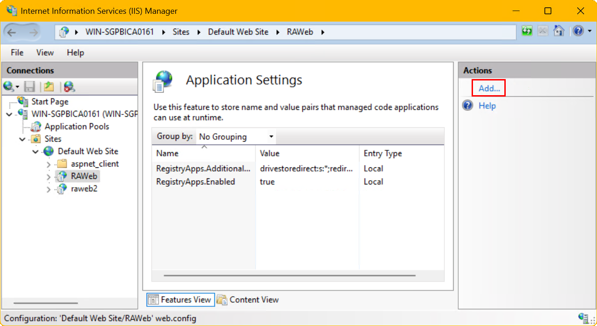

RAWeb offers several authentication modes to control access to the application. This document describes the available modes and how to configure them.

## Modes

### System authentication mode (recommended) (default)

This mode requires users to sign in with a username and password before accessing RAWeb. User credentials are manged by Windows; any user with a valid Windows account on the server hosting RAWeb or the same domain as the server can sign in.

When this mode is enabled, anonymous authentication is never allowed.

### Anonymous mode

In this mode, RAWeb does not perform any authentication, allowing anyone to access the application without signing in. It is not possible to sign in with credentials.

When this mode is enabled:
- The login page will automatically sign in as the anonymous user.
- The web app will hide the option to sign out or change credentials.
- The webfeed/workspace feature will work without authentication. A trusted certificate is still required.

### Hybrid mode

In hybrid mode, RAWeb allows both anonymous access and credential-based sign-in. Users can choose to sign in with their credentials or continue as an anonymous user.

When this mode is enabled, anonymous authentication is only allowed for the web interface; you must use credentials when access the RAWeb workspace/webfeed.

When this mode is enabled:
- The login page will show a **Skip** button, which signs in as the anonymous user.
- Users can still sign in with their Windows credentials.
- The webfeed/workspace feature still requires authentication with Windows credentials.
- Resources can be restricted to the anonymous user by placing them in a folder in `App_Data/multiuser-resources` with the name `anonymous`. Internally, RAWeb assigns the anonymous user to the RAWEB virtual domain, the anonymous username, and the S-1-4-447-1 security identifier (SID).

_Note the skip button next to the continue button:_

<picture>
  <source media="(prefers-color-scheme: dark)" srcset="./sign-in-hybrid.dark.png">
  <source media="(prefers-color-scheme: light)" srcset="./sign-in-hybrid.png">
  
</picture>

## Configuration

1. Once RAWeb is installed, open **IIS Manager** and expand the tree in the **Connections pane** on the left side until you can see the **RAWeb** application. The default name is **RAWeb**, but it may have a different name if you performed a manual installation to a different folder. Click on the **RAWeb** application.
2. In the **Features View**, double click **Application Settings** \
  
3. In the **Actions pane**, click **Add** to open the **Add Application Setting** dialog. \
  
4. Specify the properties. For **Name**, use `App.Auth.Anonymous`. For **Value**, specify the value that corresponds to the desired authentication mode:
   - System authentication mode: `never`
   - Anonymous mode: `always`
   - Hybrid mode: `allow`
5. When you are finished, click **OK**.
