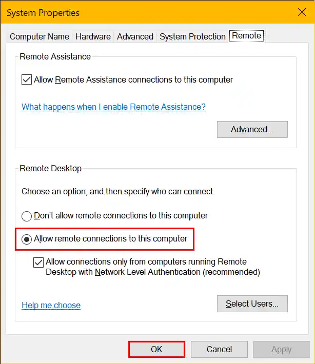

In order to connect to RemoteApps for the host server or the built-in desktop for the host server, you need to enable Remote Desktop via Windows settings on the host server. If Remote Desktop is not enabled, you will see security error 5017 when adding or managing host system RemoteApps or desktops in RAWeb.

To enable Remote Desktop on the host server, follow these steps:

1. Press the Windows key + R to open the Run dialog.
2. Type `SystemPropertiesRemote.exe` and press Enter to open the System Properties window.
3. In the System Properties window, go to the **Remote** tab.
4. In the **Remote Desktop** section, select the option that says **Allow remote connections to this computer**. \
    
5. Click **OK** to save the changes.
