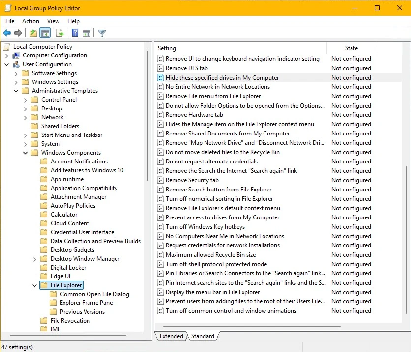

When a user launches a file-based RemoteApp via RAWeb and clicks on "File -> Open" or "File -> Save", the default Windows Common Item Dialog displays the Session Host server's local drives (e.g., `C:\`, `D:\`). This can be confusing for end-users who expect to see their own local PC's drives, and it poses a security risk by exposing the server's file system structure.

To provide a secure and seamless user experience, administrators should configure the Session Host server to hide its local drives from the users and redirect their local PC drives.

## Hiding the drives via Group Policy

To prevent users from accessing the Session Host's local drives when using the "Open/Save" dialogs, administrators should configure the following Group Policies on the Session Host:

1. Open the Local Group Policy Editor (`gpedit.msc`).
2. Navigate to `User Configuration -> Administrative Templates -> Windows Components -> File Explorer`.
3. Enable **Hide these specified drives in My Computer** (Set to: Restrict all drives).
4. Enable **Prevent access to drives from My Computer** (Set to: Restrict all drives).

## Redirecting local user drives

For users to still be able to save and open files seamlessly, their local PC drives must be mapped to the remote session. 

By default, RAWeb automatically configures the [Additional RemoteApp properties](/docs/policies/inject-rdp-properties) policy to inject the `drivestoredirect:s:*` property. Combined with the Group Policies above, users will only see their own local PC drives (e.g., `C on KULLANICI-PC`) and will not be able to browse or modify the server's file system. 

No additional configuration in RAWeb is required unless the default properties were manually overridden.
