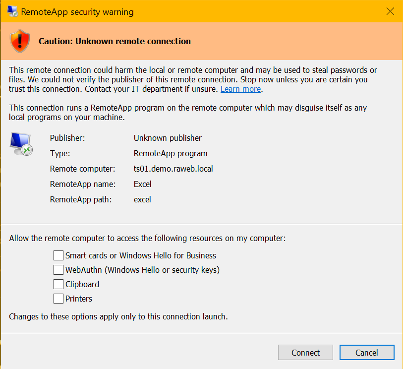
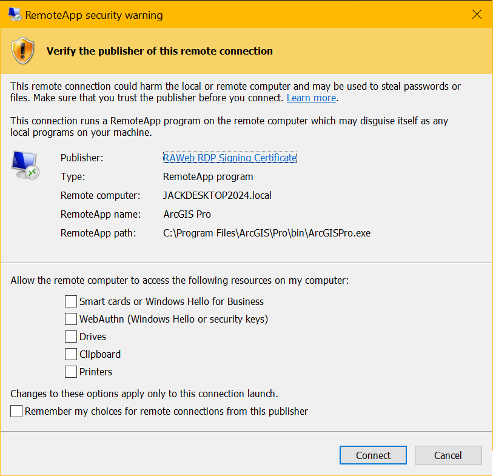

RDP file signing lets RAWeb cryptographically sign the RDP files it serves so that Remote Desktop clients can detect whether someone tampered with an RDP file's connection settings after RAWeb generated it.

## What is RDP file signing?

An RDP file is a plain text file of connection settings and can be easily modified by anyone who can access it. For example, an attacker could change the server address to redirect users to a malicious server or change the RemoteApp command line to launch a different program than intended.

RDP file signing prevents this by adding a cryptographic signature to the file that the Remote Desktop client can verify before connecting. If any signed property was changed, or if the signature does not match the certificate used to create it, the client treats the file as tampered or untrustworthy.

## Why sign RDP files?

**Security.** Without a signature, nothing stops an RDP file from being intercepted and modified between RAWeb and the client. Signing the security-relevant properties (server address, gateway settings, RemoteApp command line, drive and device redirection, and more) means a modified file will either fail signature verification or be rejected outright by the client.

**Ease of use.** Recent Windows Remote Desktop clients warn users when they open an RDP file that is unsigned or signed with a certificate the local machine does not trust. Further, users will be unable to hide repeat warnings or save connection settings. When the RDP file is signed with a certificate the client trusts, the warning may be suppressed and users can connect without interruption.

_An unsigned or untrusted RDP file shows a warning before connecting:_ 

_A file signed with a trusted certificate connects without a warning:_ 

## Letting RAWeb sign RDP files

RAWeb can sign every RDP file it serves, removing both the security gap and the client warning. This is controlled by the [Manage RDP signatures](/docs/policies/manage-rdp-signatures) policy, which also lists exactly which properties are signable.

### Certificate

Signing requires a certificate with a private key in the server's **LocalMachine\My** certificate store. During installation, the RAWeb installer offers a **Sign RDP files** option that configures RAWeb to use the certificate already bound to the IIS web site's HTTPS binding and grants the application pool identity access to its private key. This is the easiest option, since the certificate the client already trusts for HTTPS is reused for RDP file signing, and no separate certificate needs to be trusted by client machines.

Administrators who prefer a different certificate, for example, one issued specifically for code/document signing, can instead specify its thumbprint directly in the **Manage RDP signatures** policy. As with the web site's certificate, this certificate must be installed in **LocalMachine\My** with an accessible private key, and it must be trusted by client machines for signing to be effective.

### Signing modes

RAWeb does not require every RDP file to already be unsigned. The **Manage RDP signatures** policy can be set to only sign RDP files that do not already carry a signature, leaving any pre-signed file untouched, or to strip every existing signature and re-sign every file with RAWeb's own certificate, which is useful if resources are provided to RAWeb by other tools that sign their own RDP files.

See the [Manage RDP signatures](/docs/policies/manage-rdp-signatures) policy for the full list of modes, the properties covered by the signature, and troubleshooting steps if a certificate cannot be used for signing.
