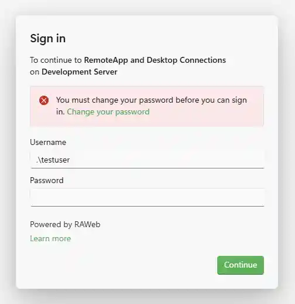
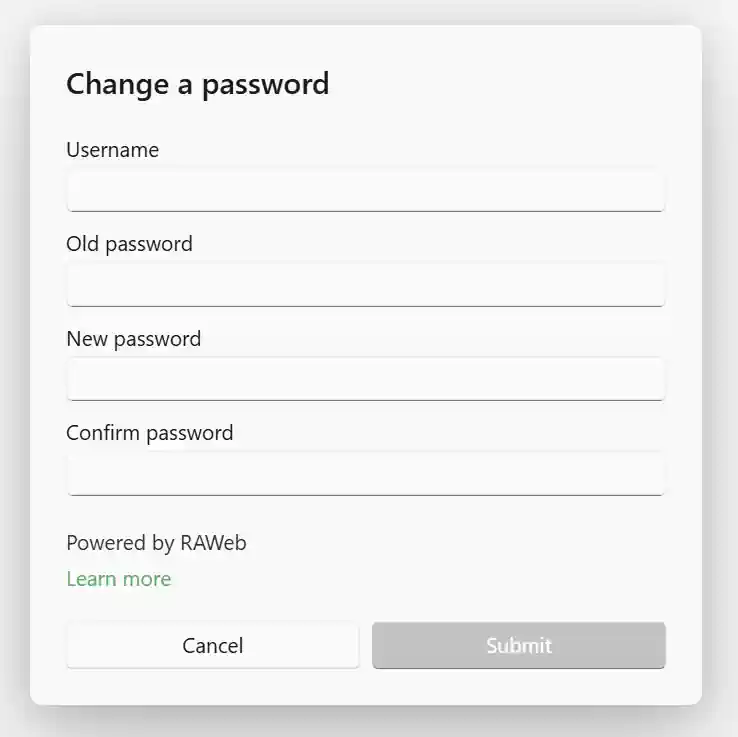

If your administrator has enabled the [change password feature](/docs/policies/change-password/), RAWeb will allow you to change your password directly through the web interface. This is especially useful if your password has expired and you are unable to sign in to RAWeb or connect to remote resources until you update your password.

## Accessing the password change feature

When the password change feature is enabled, you will see the password change option in the following locations:

### Profile menu

When you are signed in to the web interface, you can access the password change feature from the profile menu in the top-right corner of the RAWeb interface.
1. Sign in to RAWeb.
2. Click your name in the top-right corner to open the profile menu.
3. Click the **Change a password** option to open the password change dialog.

### Sign in

If your password has expired or an administrator has chosen to force a password change, you will be prompted to change you password directly from the sign-in screen.

## Using the password change feature

To change your password, click the password change option from either of the locations mentioned above. You will be prompted to enter your current password and then enter and confirm your new password. After filling out the form, click the **Submit** button to update your password.

