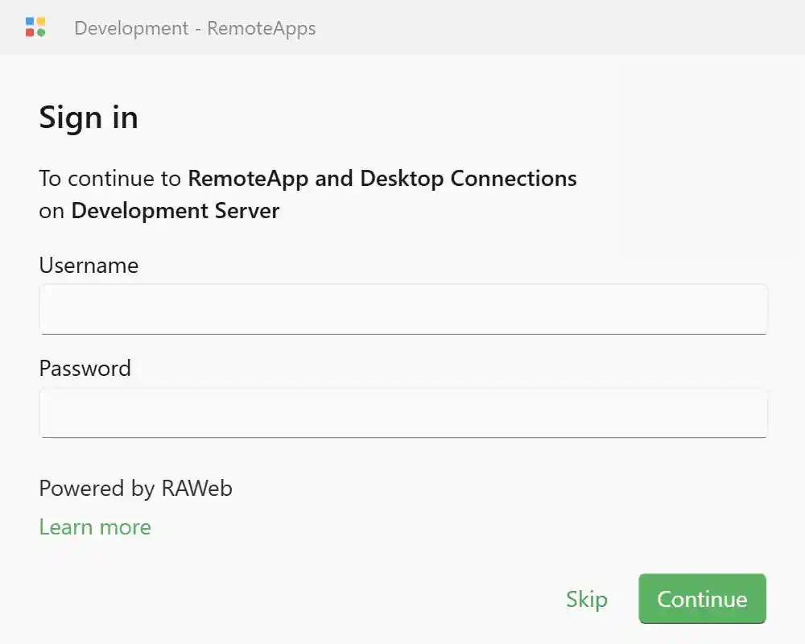

To sign in to RAWeb, navigate to the RAWeb app in your web browser. RAWeb will automatically redirect you to the sign in page if you are not already signed in.

<InfoBar>

By default, RAWeb can be accessed by navigating to https://127.0.0.1/RAWeb in a web browser on the same machine where RAWeb was installed. To access RAWeb from other computers on your local network, replace 127.0.0.1 with your host PC or server's name.

 

If you did not install RAWeb, ask your administrator for the URL for your RAWeb instance.

</InfoBar>

RAWeb will prompt you to enter your username and password. After entering your credentials, click the **Continue** button to sign in to RAWeb.\
If your administrator requires multi-factor authentication, you will be prompted to complete the additional authentication steps after clicking **Continue**.

<InfoBar>

If your administrator has enabled anonymous access, you may be able to sign in without entering a username or password.
In that case, click the **Skip** button to sign in anonymously.

</InfoBar>
