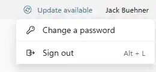

To sign out of RAWeb:

1. Click your name in the top-right corner of the RAWeb interface to open the profile menu. \
    
2. Click the **Sign out** option in the profile menu. *Alternatively, you may press **Alt + L** on your keyboard to sign out using the keyboard shortcut.*
3. RAWeb will sign you out and redirect you to the sign in page.

When you sign out of RAWeb, RAWeb will clear your authentication session and cached data related to your account's resources. RAWeb will preserve your non-sensitive user preferences in the browser.
