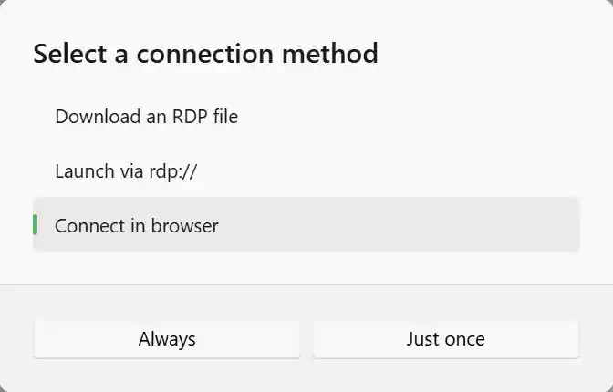
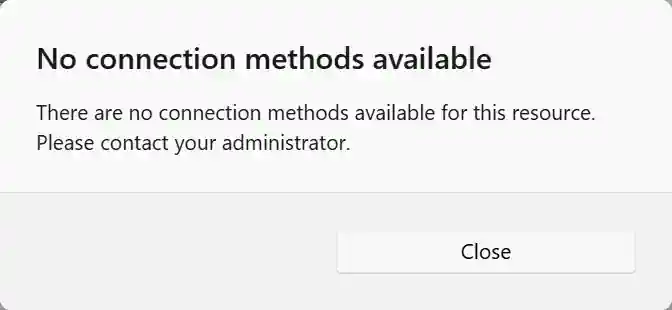

RAWeb supports multiple different connection methods for accessing remote resources. When you first connect to a resource, RAWeb will prompt you to choose a connection method. The available connection methods may vary based on the type of resource you are connecting to and how your administrator has configured RAWeb.

Available connection methods may include:

- [Download an RDP file](#download-an-rdp-file)
- [Launch via rdp://](#launch-via-rdp-protocol)
- [Connect in browser](#connect-in-browser)

The connection method dialog will show an option for each available method for the resource. To use a connection method, you may either:

(a) select the method and click the **Just once** button to connect using that method this time, \
(b) double click the method to connect using that method this time, or \
(c\) select the method and click the **Always use this method** button to set that method as your preferred connection method for that resource.

<InfoBar>
If you choose to always use a connection method, RAWeb will remember your choice and automatically use that method for future connections to the same resource without showing the connection method dialog again.
</InfoBar>

If no connection methods are enabled, you will see the following dialog: \

## Reset the preferred connection method

1. Click the **more options** button (•••) on the resource card to open the context menu.
2. Choose **Connect with...** from the menu.
3. Select a different method and choose **Just once** to clear your preferred connection method.

## Methods

### Download an RDP file {#download-an-rdp-file}

When you choose the **Download an RDP file** connection method, RAWeb will generate an RDP file for the selected resource and download it to your computer. You can then open this RDP file with a compatible RDP client application to connect to the resource.

### Launch via rdp:// {#launch-via-rdp-protocol}

When you choose the **Launch via rdp://** connection method, RAWeb will attempt to directly launch the resource without needing to download an RDP file first. This connection method may require additional software to be installed on your computer to handle rdp:// URIs.

See the table below for enabling support for rdp:// URIs on different platforms: {#additional-software-for-rdp-protocol-uris}

| Platform      | Required application                                                                                                                                                                                                                             |
| ------------- | ------------------------------------------------------------------------------------------------------------------------------------------------------------------------------------------------------------------------------------------------ |
| Windows       | [Remote Desktop Protocol Handler](https://apps.microsoft.com/detail/9N1192WSCHV9?hl=en-us&gl=US&ocid=pdpshare) from the Microsoft Store or from [jackbuehner/rdp-protocol-handler](https://github.com/jackbuehner/rdp-protocol-handler/releases) |
| macOS         | [Windows App](https://apps.apple.com/us/app/windows-app/id1295203466) from the Mac App Store                                                                                                                                                     |
| iOS or iPadOS | [Windows App Mobile](https://apps.apple.com/us/app/windows-app-mobile/id714464092) from the App Store                                                                                                                                            |
| Android       | Not supported                                                                                                                                                                                                                                    |

### Connect in browser {#connect-in-browser}

When you choose the **Connect in browser** connection method, RAWeb will attempt to launch the resource directly within your web browser. This connection method has some limitations compared to using dedicated, local RDP clients, but it can be convenient if your device does not have a compatible RDP client application available or if you prefer to connect without leaving your browser.

For more information about the **Connect in browser** connection method, see [Access resources via the web client](/docs/web-client/).
