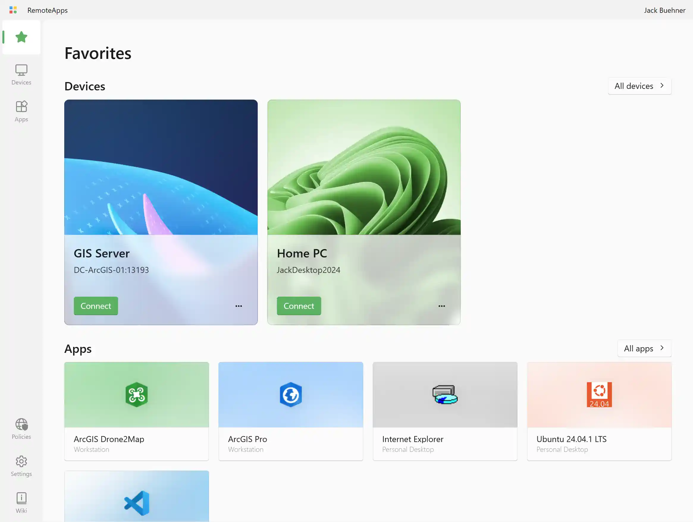

Favorites let you quickly access your most-used apps and desktops. Favorited resources appear on the **Favorites** page, which you can reach from the left navigation rail. The **Favorites** page groups your favorited resources into separate sections for devices and apps.

Favorites are enabled by default. If favorites are disabled by your administrator, the Favorites page and the add/remove options will not be available.

## Adding a resource to favorites

You can favorite an app or desktop from the **Apps** or **Devices** page:

1. Locate the resource you want to favorite.
2. Click the **more options** button (•••) on the resource card to open the context menu.
3. Click **Add to favorites**.

If the resource is published by multiple terminal servers, there will be a separate **Add to favorites** entry for each terminal server. For clairity, the terminal server name will appear below the menu item label. Favorites are tracked per terminal server, so you can favorite the same app on one server without favoriting it on another.

## Removing a resource from favorites

1. Locate the favorited resource on the **Apps**, **Devices**, or **Favorites** page.
2. Click the **more options** button (•••) on the resource card to open the context menu.
3. Click **Remove from favorites**.

## Disabling favorites

You can completely disable the favorites feature if you don't want to use it. This hides the Favorites page from the navigation rail and removes all add/remove options from each resource's context menu.

Favorites may be disabled via either of the following methods:

- [From the Favorites page](#disable-favorites-from-favorites-page)
- [From Settings](#disable-favorites-from-settings)

### From the Favorites page {#disable-favorites-from-favorites-page}

Click the **Disable favorites** link at the bottom of the Favorites page. This disables the favorites feature and hides the Favorites page from the navigation rail. This link only appears if you have no favorites.

### From Settings {#disable-favorites-from-settings}

1. Open the **Settings** page.
2. Find the **Favorites** section.
3. Toggle **Enable favorites** off.

<InfoBar>

Enabling [simple mode](/docs/simple-mode/) automatically disables the favorites feature. To use favorites, disable simple mode first.

</InfoBar>

## Exporting and importing favorites

RAWeb stores your favorites locally in your browser. You can export them to a JSON file and import them on another device or browser to restore your favorites.

### Exporting favorites

1. Open the **Settings** page.
2. Find the **Favorites** section.
3. Click **Export**. RAWeb will download a `favorites.json` file to your device.

### Importing favorites

1. Open the **Settings** page.
2. Find the **Favorites** section.
3. Click **Import** and select a previously exported `favorites.json` file.

<InfoBar>

Importing favorites replaces your current favorites with the ones in the file. The import file must be a JSON array of favorites in the format exported by RAWeb.

</InfoBar>
