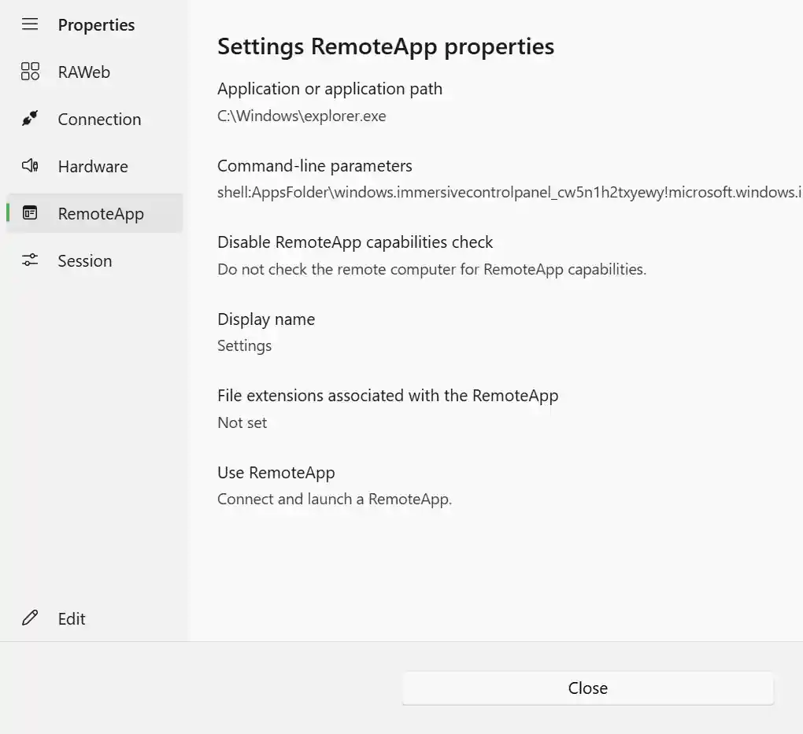

Every RemoteApp and desktop in RAWeb has a set of connection properties that describe how the resource connects to its terminal server. These properties come from the RDP file that RAWeb generates for the resource and include settings like the terminal server address, display configuration, audio behavior, and more.

## Opening the properties dialog

To open the properties dialog for a resource:

1. Locate the app or desktop on the **Apps** or **Devices** page.
2. Click the **more options** button (•••) on the resource card to open the context menu.
3. Click **Properties**.

### Selecting a terminal server

If the resource is hosted on more than one terminal server, RAWeb will ask you to select which terminal server's properties you want to view before opening the properties dialog. Select the terminal server from the list and the properties dialog will open.

## Reading the properties dialog

The properties dialog shows the RDP file properties for the selected resource, organized into sections based on the type of setting. The sections that can appear in the properties dialog include:

| Section        | Description                                                                                  |
| -------------- | -------------------------------------------------------------------------------------------- |
| **RAWeb**      | Metadata about the resource, used by RAWeb                                                   |
| **Connection** | The terminal server address, port, and other network-level settings                          |
| **Display**    | Screen resolution, color depth, and display behavior                                         |
| **Gateway**    | RD Gateway hostname and authentication settings, if configured                               |
| **Hardware**   | Device redirection settings for printers, drives, USB devices, and more                      |
| **RemoteApp**  | The application path, display name, and launch parameters (RemoteApps only)                  |
| **Session**    | Audio playback, keyboard behavior, and session-level settings                                |
| **Signature**  | The digital signature of the RDP file, if the file was signed before it was provided to RAWeb |

<InfoBar severity="attention">

Sections that have no properties set for the resource will not appear in the dialog. For example, the **Gateway** section only appears if gateway properties are configured for the resource.

</InfoBar>

Each property shows its current value. Properties that have not been set are shown as **Not set**.

To see a description for a property, hover your mouse over the property name to see a tooltip with more information about what the property does and how it affects your connection.
