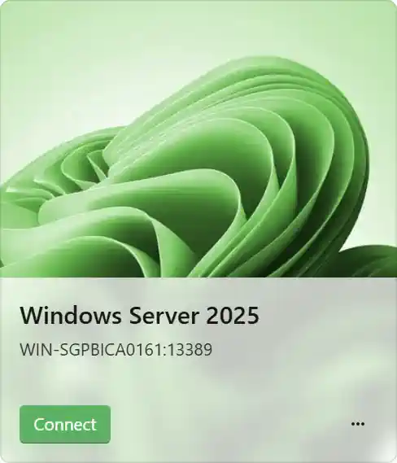

Terminal server names in RAWeb sometimes include a port number (for example, `myserver:3389`). When the same hostname only uses a single port, the port number is redundant. The **Hide ports** setting removes the port from the terminal server name in those cases, leaving just the hostname.

This setting only hides the port when a given hostname is used on exactly one port. If the same hostname appears on multiple ports, the ports remain visible so you can distinguish between them.

Hide ports is disabled by default.

| Ports visible                                                                                                                                             | Ports hidden                                                                                                                                            |
| --------------------------------------------------------------------------------------------------------------------------------------------------------- | ------------------------------------------------------------------------------------------------------------------------------------------------------- |
|  |  |

## Enabling or disabling hide ports

1. Open the **Settings** page.
2. Find the **Hide ports from terminal server names** section.
3. Toggle **Hide ports when possible** on or off.

<InfoBar>

If your administrator has configured this setting as a policy, the toggle will be disabled and you will not be able to change it.

</InfoBar>
