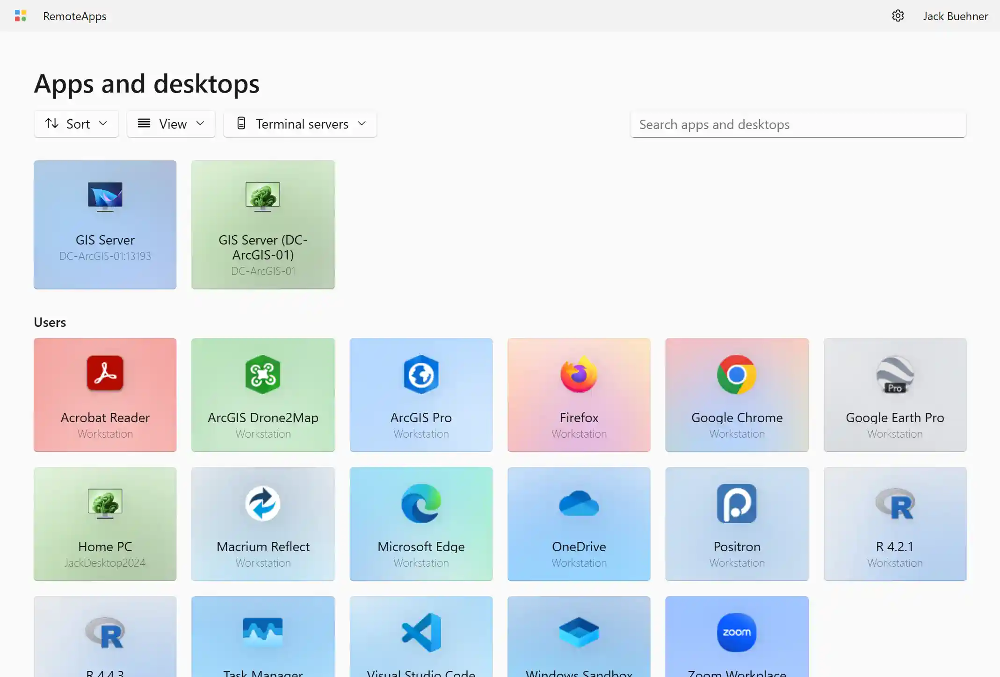

By default, RAWeb provides separate tabs for device resources and RemoteApp resources. If you want a single unified view for all your resources, you can enable simple mode in RAWeb's settings. When simple mode is enabled, RAWeb will display all devices and apps together in a single list on the home page, instead of separating them into different tabs. RAWeb will also hide the left navigation rail.

Simple mode is most similar to the RAWeb interface in versions before the Spring 2025 redesign and is ideal for users who prefer the old interface.

## Enabling simple mode

1. Open the RAWeb app and go to the **Settings** page.
2. Find the **Simple mode** option and toggle it on.
3. Exit the settings page by clicking or tapping the back button in the top-left corner of the page.

## Disabling simple mode

1. Open the RAWeb app.
2. In the top-right corner of the titlebar, click or tap the settings icon (gear) to open the settings menu.
3. Find the **Simple mode** option and toggle it off.
4. Exit the settings page by clicking or tapping any of the navigation rail buttons in the left sidebar.
