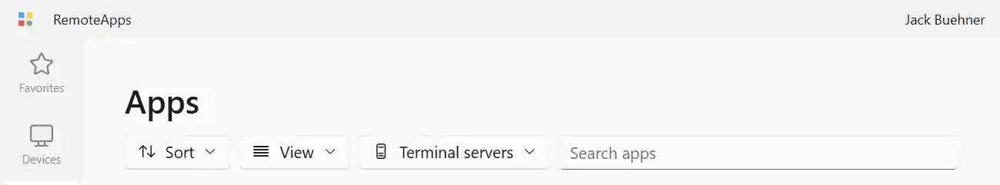
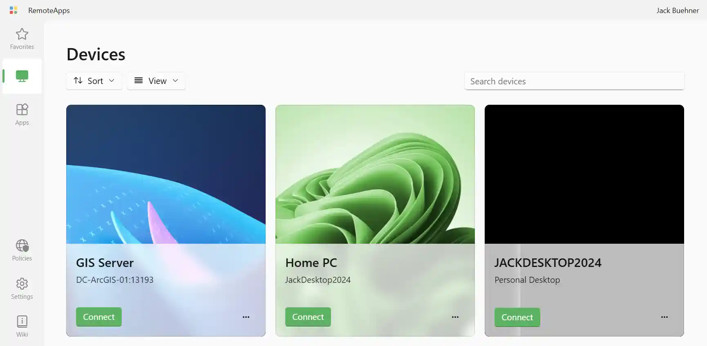
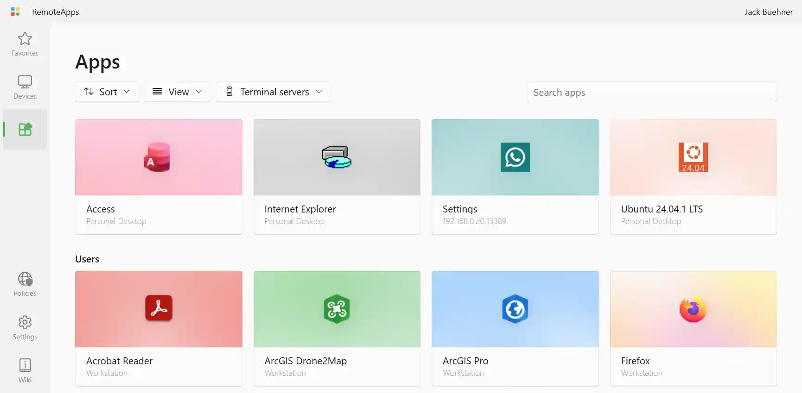
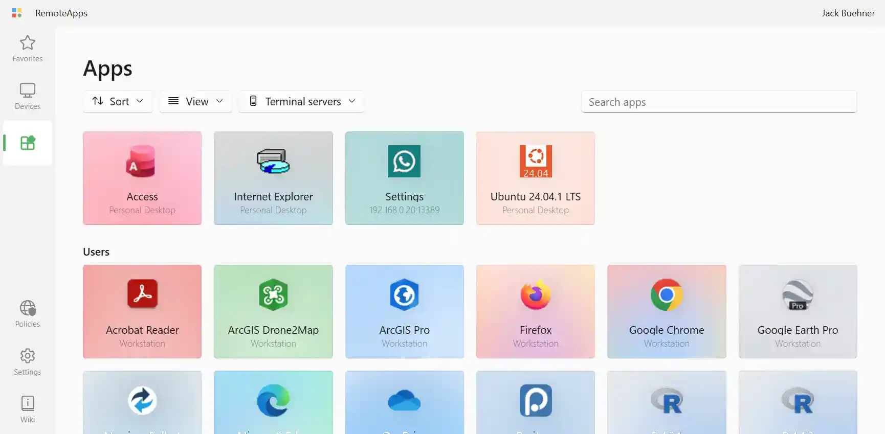
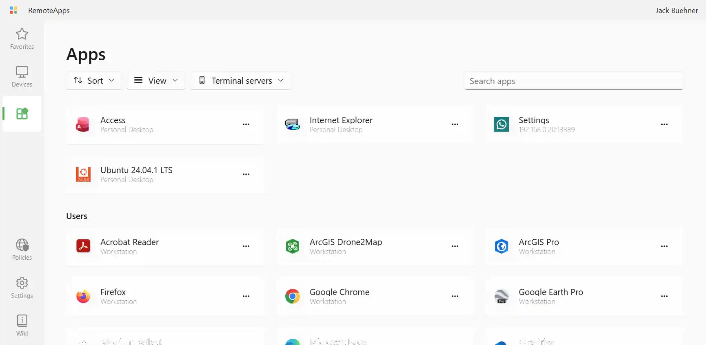
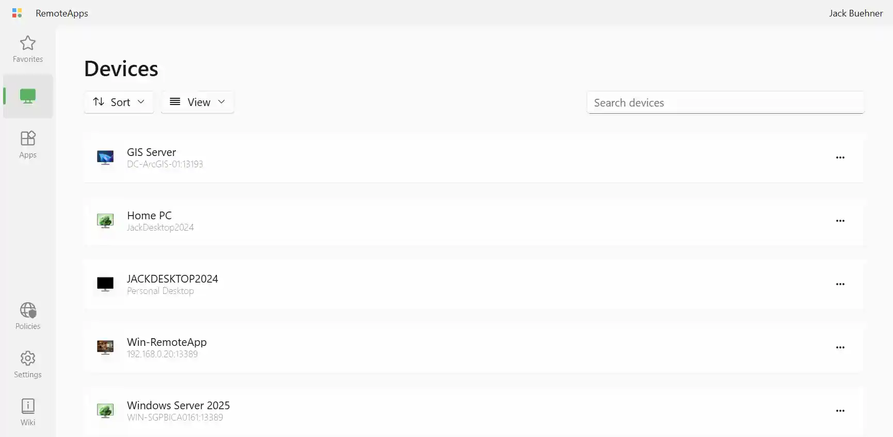

The **Apps**, **Devices**, and **Apps and desktops** (simple mode) pages each have a toolbar for controlling how resources are displayed. The toolbar includes controls for sorting, changing the view mode, filtering by terminal server, and searching.

RAWeb remembers your view mode and sort preferences separately for each page.

## View modes

The **View** button in the toolbar lets you choose how resources are listed. Four view modes are available:

- [Card](#view-card)
- [Grid](#view-grid)
- [Tile](#view-tile)
- [List](#view-list)

### Card {#view-card}

The card view is the default for the **Devices** and **Apps** pages.

On the **Devices** page, each desktop is shown as a large card with its wallpaper image in the background.

On the **Apps** page, each app is shown as a card with the app's icon and name.

### Grid {#view-grid}

The grid view displays resources as compact rectangular tiles arranged in a grid. This mode fits more resources on screen at once and is the default for the **Apps and desktops** page when [simple mode](/docs/simple-mode/) is enabled.

### Tile {#view-tile}

The tile view shows resources horizontal rectangular tiles that are vertically shorter than the card view and horizontally wider. The resource icon appears on the left, followed by the resource name and terminal server. The context menu button appears on the right. This view is similar to the tiles view in File Explorer on Windows.

### List {#view-list}

The list view is the same as the tile view, but the width of the tile is exapnded the fill the width of the page. This view is useful if you have many resources with long names.

## Sorting

Click the **Sort** button to change the order in which resources appear. You can sort by:

| Option              | Description                                                                       |
| ------------------- | --------------------------------------------------------------------------------- |
| **Name**            | Alphabetically by the resource's display name (default)                           |
| **Terminal server** | Alphabetically by the name of the first terminal server the resource is hosted on |
| **Date modified**   | By when the resource was last updated on the server                               |

Each sort option can be set to **Ascending** or **Descending** order.

## Filtering by terminal server

If your RAWeb instance has resources from more than one terminal server, a **Terminal servers** button will appear in the toolbar. Click it to open a dropdown where you can select one or more terminal servers. Only resources hosted on the selected servers will be shown.

When all servers are selected (the default), all resources are shown and the filter menu displays a checkmark next to **All terminal servers**.

## Searching

The search box in the toolbar filters the resource list in real time as you type. RAWeb matches your search text against resource names and terminal server hostnames.

Clear the search box to show all resources again.
