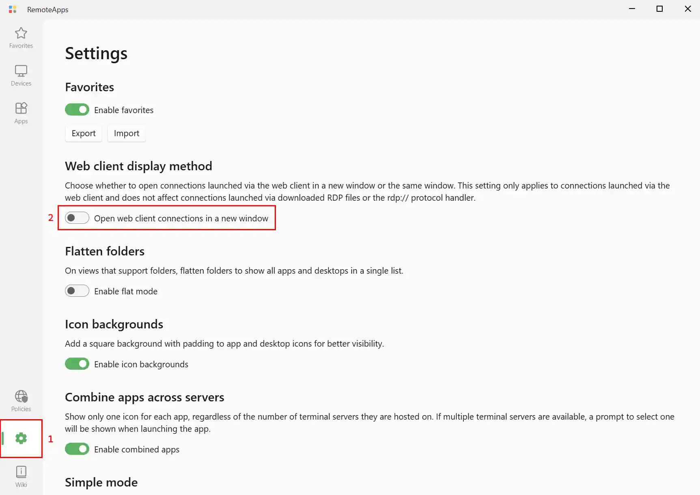

If your administrator has enabled the built-in web client, you may access all devices and RemoteApps directly from a web browser. No additional software is required on the client device.

<InfoBar severity="attention">
  The web client is a newer addition to RAWeb and is still considered experimental. While it is functional for many use cases, some features may be missing or infeasible to implement. For users who require a more stable experiences, we recommend using a dedicated remote desktop client instead.
</InfoBar>

Jump to a section:
- [Access the web client](#access-the-web-client)
- [Features of the web client](#features-of-the-web-client)
  - [Unsupported features](#not-supported)
- [Control where connections open](#control-where-connections-open)
- [Troubleshooting](#troubleshooting)

## Access the web client {#access-the-web-client}

1. To access the web client, open a web browser and navigate to the RAWeb server's URL.
2. If necessary, sign in with your credentials.
3. Navigate the **devices** list or **apps** list to find the resource you wish to access.
4. Click on the device or app to start a connection.
    - For some views, you may need to click the **Connect** button instead of clicking anywhere on the device or app.
    - By default, the web client will launch the connection in a new window.

<InfoBar title="Pop-up blockers">
  If your browser has a pop-up blocker enabled, you may need to allow pop-ups from the RAWeb server's URL for connections to open in a new window.
</InfoBar>

## Features of the web client {#features-of-the-web-client}

- **No client software required**
  - Access resources from any modern web browser without installing additional software.
- **Automatically adjust display size**
  - The web client automatically adjusts the display resolution to fit your browser window when you resize it.
- **Connect to RemoteApps and full desktops**
- **Basic clipboard support**
  - Copy and paste text between your local device and the remote session.
- **Speaker output redirection**
- **Access connections from anywhere**
  - The web client is a proxy between your browser and the terminal server. As long as the RAWeb server can access the terminal server, you can connect from any location where you can reach the RAWeb server.

### Not supported {#not-supported}

- **File transfer**: The web client does not support file transfer between the local device and the remote session.
- **Microphone redirection**: The web client does not support microphone input from the local device to the remote session.
- **USB redirection**: The web client does not support USB device redirection.
- **Advanced clipboard features**: The web client only supports basic text clipboard functionality and does not support images or files.
- **Insecure connections**: The web client can only connect to terminal servers with Network-Level Authentication (NLA) enabled.
- **Multiple monitors**: The web client does not support multiple monitor setups.

## Control where connections open {#control-where-connections-open}

By default, connections launched from the web client will open in a new browser window. You can change this behavior to open connections in the same window instead.

1. On the web app, navigate to the **Settings** page.
    - This is usually accessible via the gear icon present in the navigation rail. If you do not have a navigation rail, look for the icon in the titlebar.
2. In the **Web client display method** section, toggle the switch for **Open web client connections in a new window**.

<InfoBar severity="attention">
  If the option is disabled, contact your administrator. They may have enforced the setting via a policy.
</InfoBar>

<InfoBar title="Pop-up blockers">
  If your browser has a pop-up blocker enabled, you may need to allow pop-ups from the RAWeb server's URL for connections to open in a new window.
</InfoBar>

## Troubleshooting {#troubleshooting}

If you encounter issues using the web client, consider the following troubleshooting steps:

- **Ensure your browser is supported**: The web client requires a modern web browser that supports WebSockets and HTML5 features. Supported browsers include the latest versions of Google Chrome, Mozilla Firefox, Microsoft Edge, and Safari.
- **Download the RDP file and check if you can connect using a different RDP client**: If you are unable to connect using the web client, try downloading the RDP file for the resource and opening it with a different RDP client, such as the Microsoft Remote Desktop app. This can help determine if the issue is specific to the web client or a broader connectivity problem. If you normally must connect to a VPN before you can reach a terminal server on your local device, note that your administrator must configure the device that hosts RAWeb to connect to the VPN as well.

The web client is a newer addition to RAWeb, so there may be occasional issues. If you continue to experience problems, contact your administrator for further assistance, and work with them to [file a bug report](https://github.com/kimmknight/raweb/issues) if necessary.
