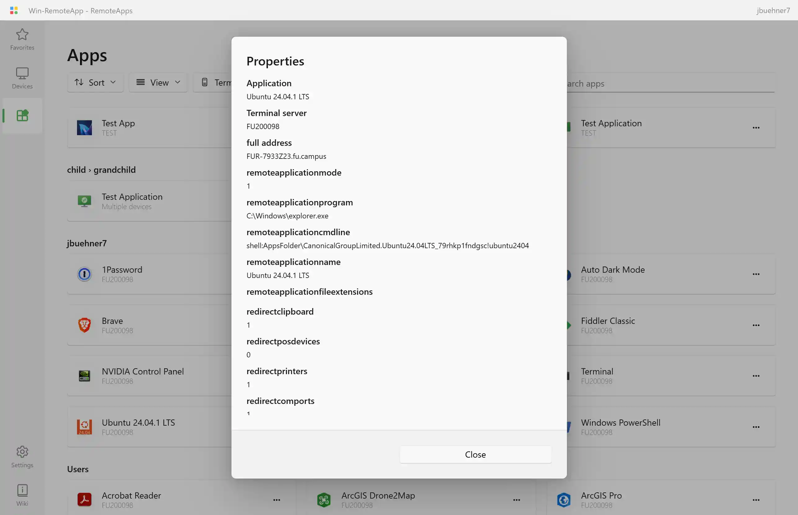

A web interface and workspace provider for viewing and managing your RemoteApps and Desktops hosted on Windows 10, 11, and Server.

To set up RemoteApps on your PC without RAWeb, try [RemoteApp Tool](https://github.com/kimmknight/remoteapptool)[^rat].

<picture>
  <source media="(prefers-color-scheme: dark)" srcset="../lib/assets/favorites_dark.webp">
  <source media="(prefers-color-scheme: light)" srcset="../lib/assets/favorites_light.webp">
  
</picture>

[^rat]: If RemoteApp Tool is on the same device as RAWeb, enable TSWebAccess for each app that should appear in RAWeb. If on a different device, export RDP files and icons and follow [the instructions](https://raweb.app/docs/publish-resources/) to add them to RAWeb.

## Features

- A web interface for viewing and managing your RemoteApp and Desktop RDP connections
  - Search the list of apps and devices
  - Favorite your most-used apps and devices for easy access
  - Sort apps and desktops by name, date modifed, and terminal server
  - Stale-while-revalidate caching for fast load times
  - Progressive web app with [window controls overlay](https://github.com/WICG/window-controls-overlay/blob/main/explainer.md) support
  - Download RDP files for your apps and devices, or directly launch them in Windows App or mstsc.exe[^2]
  - Add, edit, and remove RemoteApps and desktops directly from the web interface.
  - Follows the style and layout of Fluent 2 (WinUI 3)
- Fully-compliant Workspace (webfeed) feature to place your RemoteApps and desktop connections in:
  - The Start Menu of Windows clients
  - The Android/iOS/iPadOS/MacOS Windows app
- File type associations on webfeed clients
- Different RemoteApps for different users and groups
- A setup script for easy installation

[^2]:
    Directly launching apps and devices requires additional software. \
    On **Windows**, install the [Remote Desktop Protocol Handler](https://apps.microsoft.com/detail/9N1192WSCHV9?hl=en-us&gl=US&ocid=pdpshare) app from the Microsoft Store or install it with WinGet (`winget install "RDP Protocol Handler" --source msstore`). \
    On **macOS**, install [Windows App](https://apps.apple.com/us/app/windows-app/id1295203466) from the Mac App Store. \
    On **iOS** or **iPadOS**, install [Windows App Mobile](https://apps.apple.com/us/app/windows-app-mobile/id714464092) from the App Store. \
    Not supported on **Android**.

## Get started & installation

Refer to out [get started guide](/docs/get-started) for the easiest way to start using RAWeb.

Refer to our [installation documentation](/docs/installation#installation) for detailed instructions on installing RAWeb, including different installation methods such as non-interactive installation and manual installation in IIS.

## Screenshots

A web interface for your RemoteApps and desktops:

<picture>
  <source media="(prefers-color-scheme: dark)" srcset="../lib/assets/apps_dark.webp">
  <source media="(prefers-color-scheme: light)" srcset="../lib/assets/apps_light.webp">
  
</picture>

<picture>
  <source media="(prefers-color-scheme: dark)" srcset="../lib/assets/devices_dark.webp">
  <source media="(prefers-color-scheme: light)" srcset="../lib/assets/devices_light.webp">
  
</picture>

<picture>
  <source media="(prefers-color-scheme: dark)" srcset="../lib/assets/settings_dark.webp">
  <source media="(prefers-color-scheme: light)" srcset="../lib/assets/settings_light.webp">
  
</picture>

<picture>
  <source media="(prefers-color-scheme: dark)" srcset="../lib/assets/terminal-server-picker_dark.webp">
  <source media="(prefers-color-scheme: light)" srcset="../lib/assets/terminal-server-picker_light.webp">
  
</picture>

<picture>
  <source media="(prefers-color-scheme: dark)" srcset="../lib/assets/app-properties_dark.webp">
  <source media="(prefers-color-scheme: light)" srcset="../lib/assets/app-properties_light.webp">
  
</picture>

Webfeed puts RemoteApps in Windows client Start Menu:

Android RD Client app subscribed to the webfeed/workspace:

## Translations

Please follow the instructions at [TRANSLATING.md](TRANSLATING.md) to add or update translations.

